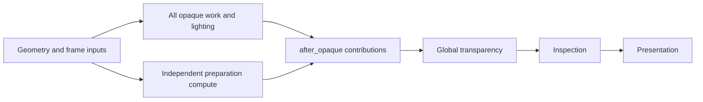

# Fresco language design and implementation reference

This is the maintained explanation of **what Fresco implements** and how the
bundled engine builds Canvas, surfaces, shading styles, particles, and renderers
from it. Use this document for semantics and composition, the
[generated reference](docs/generated/language-reference.v1.md) for exact registered
signatures, and the linked sources for complete executable examples.

**Reviewed against implementation: 2026-09-23**, through shading-style phases 1–8
and executable artifact schema **12**. Historical proposals are not implicitly
part of today's language.

- **Language** means compiler-owned syntax and semantics.
- **Library/engine** means declarations authored using those facilities.
- **Host** means application inputs, resource allocation, and GPU execution.
- **Proposed/staged** means a feature is not an implemented promise.

Implementation and behavioral tests establish current behavior. Discrepancies
should be investigated, not used to preserve bugs. The [roadmap](TODO.md) and
[style plan](docs/standard-shading-styles-design.md) track remaining implementation;
this document explains how the implemented pieces compose.

## Contents

1. [Language, engine, and host](#language-engine-and-host)
2. [Evaluation stages and scope](#evaluation-stages-and-scope)
3. [Source and ordinary programming](#source-and-ordinary-programming)
4. [Coordinates, context, and units](#coordinates-context-and-units)
5. [Canvas](#canvas)
6. [Interfaces and registered entries](#interfaces-and-registered-entries)
7. [Surfaces, materials, and meshes](#surfaces-materials-and-meshes)
8. [Styles and reusable operations](#styles-and-reusable-operations)
9. [Resources and identity](#resources-and-identity)
10. [Passes, pipelines, and annotations](#passes-pipelines-and-annotations)
11. [Bundled renderers](#bundled-renderers)
12. [Standalone techniques](#standalone-techniques)
13. [Particles](#particles)
14. [Scheduling and lifetime](#scheduling-and-lifetime)
15. [Compilation and runtime](#compilation-and-runtime)
16. [Validation and inspection](#validation-and-inspection)
17. [Compatibility and remaining design](#compatibility-and-remaining-design)
18. [Maintenance and evidence](#maintenance-and-evidence)
19. [Registered library inventory](#registered-library-inventory)

## Language, engine, and host

Fresco is a shader language with domain values and executable engine contracts.
Shapes, layers, spaces, material composition, interfaces, resource access, and
graph operations have compiler semantics. Engines use them to choose material
models, rendering algorithms, entries, and inputs. Hosts execute emitted stages.

| Owner | Defines | Does not automatically provide |
| --- | --- | --- |
| Compiler | Parsing, types, checking, specialization, rewrites, lowering, graph validation, artifacts | A scene, mesh loader, camera, or arbitrary host resource provider |
| Standard library | Registered math, geometry, paint, sampling, effects, helpers | Every engine's lighting model or rendering policy |
| Authored engine | Entries, schemas, factories, style contracts/providers, passes, recipes, techniques | Allocation/submission without an implementing host |
| Host | Resource values, uploads, allocation, pipelines, submission, completion, draw ranges | Permission to reinterpret unsupported semantics silently |
| Editor | Controls, inspection, previews, diagnostics | A separate definition of language behavior |

Names such as `standard`, `StandardStyle`, `PreviewScene`, and `after_opaque`
are engine declarations. They are not universal language keywords. Some legacy
compiler/runtime paths still recognize engine conventions; the generic direction
does not mean every such dependency has already been removed.

The design principles are to preserve authored intent, keep coordinate inversion
and execution cost understandable, diagnose missing facilities, and fix semantic
gaps at their owning layer. Parsing a construct is not proof it executes.


The [visual integration guide](docs/visual-guide.md#where-fresco-fits) distinguishes
Canvas, material, and rendering-contribution integration scopes. Its Godot and
Unreal destinations are potential adapter targets, not installed integrations.

## Evaluation stages and scope

| Stage | Examples | Result |
| --- | --- | --- |
| Compilation/specialization | Imports, type checking, static settings, renderer configuration, graph `static if` / bounded `static for` | Shader variants and graph structure |
| Host execution | Invocation expansion, allocation, bindings, dispatch sizing, ordering | Concrete work and resource lifetimes |
| GPU evaluation | Shader functions, surface evaluation, particle updates, ordinary `if`, texture samples | Values per vertex, fragment, or compute invocation |

A shader `if` does not create graph nodes. A graph `static if` selects operations:
all branches are checked, but only selected branches activate requirements.
Recipe `@when(...)` selects work through material properties. Technique
`@enabled(...)` names a host execution control. These are distinct mechanisms.

Scope is separate from stage. Material settings may be shared by many objects,
but a draw belongs to a frame/view/object/material/range. View-wide completion is
not completion of one object's opaque draw. Persistent particle state is not a
style's transient output allocation.

## Source and ordinary programming

Files contain declarations and imports. Imports compose the checked program,
not runtime module loading. The bundled
[engine.fr](integrations/example-engine/engine/engine.fr) assembles core
contracts, styles, scenes, and renderers.

| Declaration family | Purpose |
| --- | --- |
| `const`, `param`, `struct`, `enum`, `fn` | Values, configurable inputs, records, choices, shader computation |
| `interface`, `conform` | Typed methods and implementations/specialization |
| `canvas`, `surface`, registered authored entries | Content entries associated with engine contracts |
| `material_properties`, `schema_program`, `schema_expression`, `schema_evaluator` | Channels and schema-associated construction/evaluation |
| `vertex_interface`, `vertex_format`, `vertex_factory` | Vertex semantics, source layout, mesh preparation |
| `texture_type`, resource declarations, binding groups | Texture interpretation and GPU layout |
| `contract`, `capability`, `provide`, `style` | Style hooks, engine facilities, renderer bindings, implementations |
| `draw`, `compute` | Reusable operation definitions; definitions schedule nothing |
| `pass`, `pipeline` | Shader/raster definitions and composition/executable recipes |
| `effect`, rewrite declarations | Domain transformations and checked rewrite opportunities |
| Tags, axes/defaults, templates, pragmas | Metadata, specialization, compiler controls; support varies by construct |

AST representation is not a complete execution model. Const-template expansion
and some descriptive pass/axis forms remain staged. Registry keywords such as
`extern` and `internal` need their supported declaration context; the inventory
is not a promise of arbitrary combinations.

Ordinary programming is WGSL-like, augmented by Fresco domain types. This does
not imply every WGSL construct or every type Naga represents is supported. The
numeric catalog records implementation status; target/device support is separate.
Values include numeric scalars/vectors/matrices, booleans, colors, arrays,
records, enums, shapes, layers, paths, spaces, and materials. Resource handles
have additional access/lifetime rules.

```fresco
let acceleration: vec3 = vec3(0.0, -9.81, 0.0)
var next = particle
next.velocity = particle.velocity + acceleration * dt
```

`let` is immutable; `var` permits assignment and supported field/swizzle updates.
Nested record fields can be updated directly, including vector components such
as `next.velocity.y`. Swizzle assignment targets must use distinct components.
Parameters, constants, and iteration bindings are immutable. Copy into `var`
before updating. Nested bindings can shadow outer ones; leaving restores them.
Assignment rules apply even in eliminated branches. Typed constants use
`const name: Type = value`. Legacy type-first locals remain accepted, not preferred.

Calls support positional/named binding, defaults, and keyword-only restrictions;
the generated call-binding rules specify combinations. Pipes
(`value |> operation(...)`) feed values into operations. Overloads and generic
specialization resolve supported concrete types, not dynamic GPU method dispatch.
Shader blocks support checked assignment, `if`, `match`, loops, return, and
`break` in their applicable contexts. Graph construction has narrower rules.
Pass-local service iterators are bounded compiler-lowered iteration, not arbitrary
allocated iterators or host callbacks.

Integer behavior is explicit. Use wrapping arithmetic where modular behavior is
intended, such as deterministic hashing. Host allocation expressions such as
`checked_mul(...)` instead reject overflow; a GPU wrapping helper is not a safe
substitute for an allocation bound. Numeric conversions and resource widths must
match their checked contracts.

Runtime `param` values become reflected inputs. Static/permutation settings select
variants. Ranges guide UI and applicable checks but do not replace allocation
validation or shader guards.

| Overloaded spelling | Meaning in context |
| --- | --- |
| Local Canvas style | Lexically scoped painting defaults |
| `style Toon for standard : StandardStyle` | Surface-style implementation |
| Canvas `compose` | Ordered picture/layer composition |
| Surface `compose` | Material channel combination |
| Entry-method `@compose(p)` | Thread returned state through a parameter |
| Channel `@compose(...)` | Material channel combination rule |
| Raster blending | Combine a draw with its destination attachment |

### Callable parameters, overloads, and records

Supported higher-order helpers accept typed callable parameters and specialize
known function references. For example:

```fresco
fn double_value(x: f32) -> f32 { return x * 2.0 }
fn apply_value(f: fn(f32)->f32, x: f32) -> f32 { return f(x) }
```

Top-level and supported local function references can be passed this way; arity
and argument/result compatibility are checked. Scalar and shape-returning cases
have executable coverage. This does not promise arbitrary runtime function
pointers, escaping closures, recursion, or the same callable support in every
GPU lowering path. Callable effects also have dedicated checking; locality is not
permission to introduce undeclared host work.

Use `*` for keyword-only parameters: `fn tone(x: f32, *, gain: f32) -> f32`.
The `gain` argument must be named. Interface/conformance method signatures must
agree on that boundary. A duplicate or trailing separator is rejected.

Parameter unions such as `fn lift(x: i32|vec2) -> f32` are declaration-only overload
sugar, not runtime union values. Multiple union parameters expand as a Cartesian
product. Every concrete branch is checked, including uncalled branches; duplicate
signatures fail. Overload resolution uses arity and concrete argument/type-family
information, including scalar specialization. Ambiguous best matches fail rather
than depending on declaration order. Use explicit types/conversions to disambiguate.

Struct values group typed fields and support constructors, projections, parameters,
results, and locals. Named constructors must account for required fields and reject
unknown/duplicate names; supported typed GPU paths also accept positional
construction, as the engine's vector/record examples demonstrate. Update a mutable
local copy, not an immutable function argument:

```fresco
struct Orbit { center: vec2; radius: f32 }
fn nudge(state: Orbit) -> Orbit {
    var next = state
    next.center = state.center + vec2(0.1, 0.0)
    return next
}
```

Supported lexical local functions and imported helpers retain definition scope;
imports do not give a helper arbitrary access to a caller's locals. Import cycles
and imported-file diagnostics retain source attribution. `internal fn` is used
for implementation helpers in library sources; do not infer a general package
privacy/security boundary from this spelling.

## Coordinates, context, and units

#### Orientation and pure animation signals

The bundled Canvas mapping uses bottom-left origin, +X right, and +Y up.
Use `orientation(y: down)` in a local space or `canvas_space` for a top-left
interpretation. A custom engine still supplies the actual context coordinates;
the language cannot repair an engine pass that violates its chosen convention.

`wave`, `pulse`, and `ramp` construct time-dependent scalar expressions rather
than stateful simulations. Period, phase, range, and easing describe evaluation
against the context clock. Seeking a pure signal evaluates that time directly;
it does not replay prior frames. For example, a wave can drive a shape radius or
color, and `ease` can transform an interpolation amount. These computations have
shader cost; the archive's description of signals as costing nothing is not a
performance guarantee. Range validation is consumer-specific: do not assume that
every `a .. b` occurrence supports reversed or runtime-crossing endpoints.

## Canvas contracts and context

`canvas` is engine-supplied shorthand registered through `@entry(canvas, draw)`,
using the language's general entry mechanism. Integration authors can change or
extend the interface, context, and executing passes in their engine source;
authored content must satisfy the resulting contract.

The typed Canvas entry is implemented. The engine declares a context, annotates
semantic fields, registers a method, constructs a value, and calls content with
it. Variables named `uv` or `time` are not magical globals. The bundled contract:

```fresco
struct CanvasContext { @semantic(coord) uv: vec2; frame: FrameGlobals }

@entry(canvas, draw)
interface Canvas {
    fn draw(@context ctx: CanvasContext) -> color
}
```

| Role | Type | Use |
| --- | --- | --- |
| `coord` | `vec2` | Sampling, shapes, coordinates |
| `time` | `f32` | Animation, rate literals |
| `delta_time` | `f32` | Explicit time-step computations |
| `resolution` | `vec2` | Pixel units, footprints |

Nested fields can supply roles. Missing/duplicate roles are diagnosed. Renaming
ordinary variables does not change semantic lookup. `context(time)` reads the
resolved role. `ctx.uv` projects immutable input, while `context(coord)` reads
the active sample coordinate; transforms/resampling can make these differ.
Spatial operations do not mutate the original context record.

Canvas supports `in context value { ... }`, restoring the prior context on exit.
Do not extrapolate this to arbitrary shader helper bodies. Helpers should receive
required inputs explicitly. Broader helper and temporal-context support must be
validated separately from the implemented entry contract.

### Spaces and units

A space maps sample coordinates. Content transforms generally require inverse
mapping: moving a shape right means sampling its original field at a coordinate
shifted left. `in space ...` establishes a scoped mapping; named spaces and
`canvas_space` support reuse. Rewrites/materialization must preserve coordinates
and filtering footprints.

Units include pixels, UV, viewport-relative values, angles, and time. Pixel and
viewport units need context. Attached `/s` or `/ms` evaluates against absolute
context time: `20deg/s` means `20deg * context(time)` and `1px/ms` means
`1000px * context(time)`. This is not accumulated integration. Omitted numerator
units work (`2/s`).

Suffixes must be attached: `20deg / s` is not equivalent. Bare `s` and `ms` are
reserved unit symbols, although argument labels such as `s:` remain labels.
Standalone `1s` and `1ms` are numeric values 1 and 0.001. Division by a variable
holding one is ordinary division. Literal denominators such as `20deg / 1s` are
rejected in favor of attached suffixes. Missing a time role is an error.


See the [nested-space walkthrough](docs/visual-guide.md#how-nested-spaces-compound)
and the [coordinate diagrams](docs/visual-guide.md#spaces-and-inverse-sampling)
for the matching polar-space example and adjustable sample lookup.

## Canvas

A Canvas returns a picture evaluated as color at the current sample. With the
bundled engine contract:

```fresco
canvas badge(ctx: CanvasContext) -> color {
    compose {
        fill(#182030)
        circle(at: (0.5, 0.5), radius: 20px) |> fill(#f5ad69)
    }
}
```

A **shape** describes a field/coverage boundary; a **layer** describes a picture.
Painting turns a shape into a layer. Composition combines layers in authored
order with selected blend semantics. Analytic effects on shapes may be cheaper
than the same visual operation on arbitrary pictures; the compiler preserves this
distinction rather than immediately converting everything to textures.

| Facility | How it participates |
| --- | --- |
| Shapes and boolean/field operations | Geometry and coverage before painting |
| Fill, stroke, gradients, color operations | Paint evaluated at a sample |
| Paths and queries | Curves, strokes, positions/tangents, path-relative construction |
| SVG/vector inputs | Imported supported path geometry |
| Spaces/transforms | Coordinate remapping and scoped footprints |
| Cellular spaces | Cell ownership, local coordinates, metadata |
| Scatter | Repeated/composed content with instance data, not persistent particles |
| Effects/rewrites | Analytic transformation where valid, otherwise supported sampled lowering |
| Materialization/temporal sampling | Intermediate evaluation where the strategy supports it, not arbitrary persistent simulation |

[Gradients](#gradient-coordinates-and-typed-texture-decoding) are usable color inputs for painting, effects,
and materials. [Cellular spaces](#cellular-ownership-and-filtering) establish ownership rather
than simply layering overlapping cells. Constant and uploaded paths must preserve
geometry/boundary semantics. Scatter expansion and sampled effects can introduce
substantial shader work; inspect the selected lowering.

Execution follows this chain:

1. Check the Canvas against the registered `Canvas.draw` method.
2. The engine's `present_canvas` pass constructs `CanvasContext` from frame
   resources and fullscreen varyings, then calls `content.draw(ctx)`.
3. Checking, domain rewrites, and lowering produce shader stages and resource
   metadata, with supported materialized work where needed.
4. The host supplies inputs, creates reflected pipelines, and executes the plan.

The executable contract is
[04_canvas_contract.fr](integrations/example-engine/engine/core/04_canvas_contract.fr).
Native and browser engine previews share Rust rendering. Retired browser renderer
code is not another authoritative implementation; editor thumbnails/visualizers
have narrower separate responsibilities.


### Explicit fields, layers, and resampling

`field expression` explicitly constructs a scalar field; `layer expression`
constructs a drawable color expression. They give coordinate-dependent math a
place in the domain model rather than requiring a special named builtin for each
pattern. `field` requires a scalar result, and `layer` requires a color result.
`value at coordinate` resamples supported field/color-field expressions. Use the
resolved context/sample-coordinate rules above rather than the archive's old
Canvas argument names.

`L through space S` evaluates an existing layer under a space mapping, reusing
the `in space S { L }` lowering. The point-pure path supports refraction-like
warps without allocating a texture. This is not evidence of automatic render-target
materialization for arbitrary operands. See the executable
[through-space example](<examples/10) fundamentals/through_space_refraction.fr>).
Dynamic color expressions can be compose entries directly. A composed result can
also pipe through `postprocess(fn)` for supported point-local color finishing;
this operation is distinct from a renderer `pipeline(postprocess)` category.


The [field walkthrough](docs/visual-guide.md#fields-a-number-at-every-coordinate)
links the spatial view, a one-dimensional slice, and coverage used for paint.

### Gradient coordinates and typed texture decoding

Builtin color inputs accept both colors and gradients: fills, shape/path strokes,
tint, shadows, soften, glow, inner glow, bevel highlights/shadows, gradient stops,
and color transforms such as `lighten`, `darken`, `saturate`, `desaturate`, and
`mix`. Material albedo and emissive inputs also accept gradients. This applies to
color inputs, not arbitrary raw expression parameters of other kinds.

For example, this Canvas uses a gradient as tint on a direct shape fill:

```fresco
canvas gradient_tint(ctx: CanvasContext) -> color {
    let ink = gradient(along: x, stops: [
        stop(at: 0.0, color: #f008),
        stop(at: 1.0, color: #08fc)
    ])
    compose {
        circle(at: (0.5, 0.5), radius: 0.3)
            |> fill(#fff)
            |> tint(ink)
    }
}
```

Color transforms operate on the sampled color. Linear and radial gradients used
as color inputs share interpolation and dithering behavior with gradient fills.
Generated signatures and editor hints advertise these inputs as `color | gradient`;
that notation describes the accepted color-input alternatives, not a new runtime
union-value representation.

Linear gradients accept axis aliases or a direction vector; radial gradients use
an explicit center and radius. Stops contain position and color expressions and
can depend on parameters/signals. RGB and alpha are interpolated at the receiving
operation's coordinates. Author ordered stops rather than assuming arbitrary
reordering of dynamic stop expressions.

Linear gradients default to `anchor: scene`, following the active space, not
implicit shape UVs. `anchor: shape` is implemented for supported shape receivers,
including a tint on a direct shape fill; it normalizes to that receiver. A fullscreen color,
material, scalar helper, or composition without one owning shape cannot provide
that shape anchor. Material gradients use surface UVs. A linear gradient on a ring
does not become angular automatically: use a polar mapping for angular progression.
In an upward Y space, `along: y` runs bottom to top; orientation changes that mapping.

Texture sampling uses explicit coordinates: `image(tex, at: uv)` or `tex.at(uv)`.
Typed texture channels give names to source channels and can declare affine or
expression decoding. In a decode expression, `raw` denotes the selected channel
and `texel` provides the sampled texel's components. Packed-data helpers such as
`bit_extract`, `unpack_unorm8`, and `unpack_snorm8` participate in supported decode
expressions. Channel interpretation does not change the need for a compatible
resource format/sampler. A typed texture declaration alone does not establish
comparison sampling, layered sampling, or divergent-control-flow safety.

See the generated texture parser/signature notes for supported decode forms. The archive's shape-anchor proposal
and implicit texture-read examples are not current restrictions or preferred syntax.


### Building and sampling a user effect

Effects can explicitly sample their receiver, as in
[chromatic_split.fr](<examples/16) user-effects/chromatic_split.fr>):

```fresco
effect chromatic_split(spread: f32) local(spread) {
    let left = self at (coord - (spread, 0.0))
    let right = self at (coord + (spread, 0.0))
    layer rgba(r: left.r, g: self.g, b: right.b, a: self.a)
}
```

`self` is the incoming layer; `at` evaluates it at another coordinate.
`local(spread)` describes a neighborhood footprint. `layer` constructs the result.
This is a shader/domain operation, not a new host draw. A wider neighborhood can
multiply evaluation cost or require a supported materialization strategy.

An effect can carry a rewrite such as the following checked-in pattern:

```fresco
rewrite neighborhood(a) compose neighborhood(b) => neighborhood(a) when a > b
```

It matches a specific operation composition and optional guard; it is not a
universal algebraic optimizer or a proof that any claimed equivalence is valid.
The author owns the rule's semantic correctness, while the compiler checks its
supported matching/guard/locality contract. Explain output reports selected
rewrites. See [the receipt example](<examples/16) user-effects/rewrite_locality_receipt.fr>)
and the [rewrite work list](TODO.md#rewrite-contracts-and-follow-up).


### Scatter, paths, and cells

This excerpt from
[scatter_index_phase.fr](<examples/10) fundamentals/scatter_index_phase.fr>)
constructs a layer from deterministic instances:

```fresco
    let streaks = scatter 12 within region((0.08, 0.2) .. (0.92, 0.8)) seed 11 strategy compact
    lifetime worm: 3.5s respawn every rand(3s .. 5s) {
        let drift = wave(period: 6s, shape: saw, phase: worm.index01, range: -0.06 .. 0.06)
        let tip = worm.pos + (drift, 0)
        capsule(from: worm.pos, to: tip, radius: 0.008) |> fill(#ffffff)
    }
```

The instance binding exposes position and lifetime/index information. The result
is later composed as `streaks |> blend(add)`. A lifetime here describes evaluation
from context time and seeded instance data; it does not allocate the persistent
particle buffers discussed below. Expansion strategy and instance count affect
code size/work, so a large scatter is not assumed to be free instancing.

Paths expose geometry and arc-length queries (`point_at`, `tangent_at`), while
`contour` represents a closed cell boundary with distance/perimeter queries.
Neither is itself a painted layer. `svg_path` imports its supported path commands;
this is not a full browser SVG implementation. For example, the shipped
[SVG path badge](<examples/20) techniques/svg_path_badge.fr>) uses line-only
`M`, `L`, and `Z` data and then fills the resulting shapes.

Cellular spaces select one owner, expose cell identity/center/local coordinates,
and clip content to that ownership. `cells` ends its transform chain; subsequent
transforms are nested. Supported layouts and sampling grids appear in the
inventory. Contour helpers support boundary-relative designs without building
independently overlapping copies. Filtering must account for owner boundaries,
not merely smooth the interior drawing.

### Cellular ownership and filtering

`cells` chooses a single owner in normalized lattice space, then maps the sample
into that site's local drawing frame. `square`, `brick`, and `jittered` retain
square ownership; `hex` uses a staggered triangular lattice; `voronoi` selects the
nearest bounded seeded site. Jitter changes site placement, not the ownership
shape of a `jittered` cell. Scalar or vector `every` scales the axes; nearest-site
distance is measured before those scales are reapplied.

Required arguments are `layout`, `every`, `seed`, and `sampling`. The period is
positive, finite, and compile-time; the seed is an integer in `0..65535`.
`jittered`/`voronoi` require compile-time `jitter` in `0..1`; other layouts reject it.
`cells` ends its transform chain, and `cell:` binds only the immediate body.
Later transforms go in nested spaces. Bound cell queries retain their captured
frame rather than adopting a nested mapping's coordinates.

Cell metadata includes stable generating `id`, local `center`, `uv`, `local`,
`angle`, `rand`, and inward `edge_distance`. `center` is `every / 2` in the mapped
frame, not the world-space site. Irregular/hex cell UVs can exceed `[0,1]`.
Randomness is deterministic in ID/seed, independent of time. Coordinates remain
f32 and the ID hash assumes i32-range IDs; this is not arbitrary-precision tiling.

Only one owner contributes at each sample; motifs/glows clip at ownership edges.
Use scatter for overlapping instances. `center`, `grid2x2`, `grid3x3`, and `grid4x4`
select 1, 4, 9, or 16 screen-pixel samples. Each reevaluates the mapping, owner,
context, and body. Shape occupancy is integrated without a second analytic-AA
application, and colors are alpha-weighted. Nested cells share the outermost
grid rather than multiplying sampling budgets. Bounded loops share the shading
body, but higher sampling/search complexity still increases GPU work.

Boundary queries distinguish normalized distances from local drawing coordinates:
`inset_distance` is a half-plane contour field, while `boundary_point` returns an
angular ray intersection. `contour` provides finite-segment Euclidean distance,
perimeter progress/length, and points; `edge_distance` retains half-plane behavior.
Collapsed contours have no chase light. Pixel insets/widths/motion use the incoming
screen metric, locally approximated for nonlinear transforms. `chase` returns
brightness and `band` a scalar mask, not drawing layers or GPU resources.

Finite grids can miss subpixel features, and discontinuous parent mappings can
lose footprint information. This is bounded numerical filtering, not exact
coverage for arbitrary shader math. The
[cellular Voronoi sample's block comment](<examples/20) techniques/cellular_voronoi.fr>)
contains the layout/member tables, boundary/contour recipes, motion modes, costs,
and detailed edge cases. Compiler coverage is in
[cellular_spaces.rs](crates/fresco-cli/tests/cellular_spaces.rs); local GPU checks
in [cellular-spaces.spec.mjs](crates/fresco-wasm/web/tests/gpu/cellular-spaces.spec.mjs)
compare independent ownership/quadrature and higher-resolution live renders.


### Scatter strategy and random scope

`compact` and `branch` are alternative scatter lowering strategies for binned
instance evaluation; their relative cost depends on occupancy and generated work.
`procedural` reconstructs synthetic instances and currently rejects lifecycle
bindings. Lifecycle scatter requires a named instance binding. Its context exposes
placement, normalized index, and normalized age; legacy non-lifecycle blocks may
use `instance`.

`rand(lo .. hi)` in scatter is deterministic from the scatter seed and instance
identity, not a fresh host random draw each frame. It is supported in scatter body/
lifecycle evaluation; use outside scatter is currently diagnosed. This restriction
does not prohibit separately defined hash/noise functions with explicit inputs.

## Interfaces and registered entries

Interfaces declare typed methods; conformances and entry specialization bind
implementations. Checking covers names, arguments/results, required methods, and
defaults. Compatibility and explicit selection resolve engine passes; declaration
order is not a selection rule.

`@entry(declaration_name, method)` registers a single-method entry such as Canvas.
Multi-method entries expose typed named bodies and configuration. The engine
chooses the names: particles use `emitter` with `spawn` and `update` bodies.

Entry configuration is distinct from shader locals. `@config(...)` controls
exposure; `@permutation` marks specialization. Entry-method `@bind(alias)` names
the callable engine hook. `@compose(p)` threads returned state through the named
parameter, preserving unrelated fields. `@pure` participates in supported shader
hooks; it is not a general effect-system promise.

See the detailed rules below and
`crates/fresco-cli/tests/engine_entries.rs` for typed-context, renamed-entry,
configuration, and state-threading acceptance cases.

### Entry methods, settings, and composition rules

Named method blocks inherit parameter names, types, context designations, and
return types from their registered interface. Sibling methods are typed lexical
functions; declaration order does not order execution. The engine's entry method
selects execution. Unknown/duplicate blocks, missing required methods, duplicate
registrations, and unregistered declaration names are errors. Explicit `fn`
implementations must match the contract, including `@context`, but may rename
parameters. Single-method entries also support the typed shorthand used by Canvas.

Entry settings use `name: expression` alongside methods. They are compile-time
values, not implicit uniforms. Defaults exist only when declared; missing required
settings, unknown/repeated fields, and runtime/context-dependent values are errors.
Settings bind in declaration order, so a default may refer to an earlier setting.
Shorthand entries receive engine defaults too.

`@compose(p)` names the first positional, non-context parameter, whose type must
match the method result. In a named block the compiler inserts the current state
as the first argument to each module call and threads the entire returned record
to the next call. Source order is execution order; an empty stack returns its input.
Only module calls are accepted in this sugar. Explicit `fn` implementations retain
ordinary control flow. Generic modules preserve extra fields in an explicitly
declared concrete record; this does not infer persistent storage fields.

For compute entries, `pipeline(compute) ... for Interface` is an inert template
until an authored entry instantiates it. Exactly one template must match. Its
interface passes specialize with the entry's settings/methods; ordinary draw passes
remain reusable. Method `@bind(alias)` exposes engine-callable hooks. Missing or
duplicate aliases and collisions with pass hooks are diagnosed.

### Source-backed controls and contextual vocabulary

`param @config(editor) name: Type = value` exposes entry configuration in the
Options inspector. Numeric values use numeric controls; booleans/enums use choices.
`@permutation` identifies specialization. Edits insert an authored override or
replace its compiler-reported UTF-8 byte range, then recompile. Values are saved
in source, not hidden preview state. A new compilation refreshes edit ranges.

Editor contextual keywords come from reachable `@entry` declarations, including
engine modules and transitive imports. Entry names and method blocks are highlighted
as keywords in their declaration contexts; identically spelled variables/calls
remain identifiers. Unimported interfaces add no vocabulary. Renaming an engine
entry does not require maintaining a separate editor keyword list.

## Surfaces, materials, and meshes

A surface produces **material data**, not final lit display color. Engines define
schemas/channels. The bundled `standard` schema includes base channels, roughness,
metallic, normal-related data, and occlusion; `unlit` follows another evaluation
path. These are engine names.

```fresco
surface copper(sp: surf) -> material(standard) {
    param tint: color = #b87333
    compose {
        base(albedo: tint, roughness: 0.3, metallic: 1.0)
    }
}
```

`material_properties` defines channels, defaults, inheritance, and composition.
Schema expressions/programs/evaluators connect construction to evaluated data.
Texture types describe extraction, encoding, and coordinate/normal conventions:
encoded albedo and tangent-space normals are not interchangeable raw `vec4`s.

Texture use also has an explicit input contract. Authored texture types describe
which channels/encoding a material consumes; shader resources describe how GPU
sampling is bound. Ordinary samples need coordinates and the relevant sampler.
The CLI's implicit-texture-UV option is a temporary migration path, not the model
for new source. Encoded color must be decoded according to its contract before
linear lighting; display conversion occurs later.

Surface `properties` are checked engine options: blend, sidedness, style, profiles,
usage, and renderer permutations. They determine variants and legal operations.
Runtime parameters are separate. Coverage, attachment blending, and display
conversion are not silently delegated to a style's lighting hook.

| Mesh contract | Responsibility |
| --- | --- |
| Vertex format | Concrete streams and formats |
| Vertex interface | Required semantic values |
| Vertex factory | Prepare inputs and bind draw/frame resources |
| Surface/schema evaluator | Produce material data at the shaded point |
| Raster pass | Transform vertices, evaluate coverage/shading, write attachments |
| Host draw range | Identify actual object/material/index or vertex range |

[05_mesh_contract.fr](integrations/example-engine/engine/core/05_mesh_contract.fr)
defines `PreviewMesh`, `preview_static`, `PreviewScene`, draw records, and prepared
geometry. `PreparedMesh` carries typed vertices/indices, counts, and bounds. It is
an engine contract, not a universal layout. Some legacy lowering still recognizes
factory conventions; generic names do not imply unrestricted factory execution.

### Surface properties and defaults

`@surface_properties(block_name, Schema)` associates a property interface with
material schemas; inherited materials use the nearest association. Omitting schema
names declares a shared property schema. Fields use typed parameters and explicit
defaults. Unknown/duplicate fields or blocks, invalid values, and missing required
values are errors. Custom static fields can specialize the surface body.

- `@config(editor)` exposes an editable source-backed option.
- `@config(engine)` marks an engine-owned setting and rejects material overrides.
- `@profiles(inherit, standard, unlit)` maps enum choices, in declaration order,
  to material contracts. `inherit` preserves the authored result schema.
- `@range(min, max)` checks a numeric setting.
- `@usage(factory)` requests a vertex-factory variant. Multiple usages form a set;
  unknown/incompatible factories fail. Declared usage controls must select a usage.
- `@evaluation_axis(axis, ...)` maps boolean/enum choices to schema-evaluator
  permutations. The selected combination must identify one emitted variant.

Explicit surface properties override active entry `@surface_defaults`, which
precede ordinary property-schema defaults. Importing an interface alone does not
activate its entry defaults. Active defaults currently apply across the effect's
surfaces; conflicting active entry defaults are ambiguous, not ordered by source.
For multiple property schemas, defaults must identify the intended schema.

The editor edits each surface independently with compiler-supplied source ranges.
Renderer selection configures engine-owned values without rewriting material source.
A usage requesting skinning does not synthesize bones, streams, or a runtime adapter.

### Material channels and structured composition

All channels and defaults come from the selected `material_properties` schema.
Omitted initial channels use declared defaults; absent defaults require assignment.
An emissive-only initializer is legal when the other channels have defaults.
`@default_material` selects the schema for an unqualified `material` result.
`@context(Type, name)` establishes the schema context; `@composition(base, material,
weight)` names the initializer, subsequent layer call, and optional weight argument.

Channels support scalars, vectors, colors, matrices, fixed arrays, and nonrecursive
records. Unweighted assignments replace named channels; omitted channels preserve
previous values. Weighted assignment requires an initialized previous value and an
explicit inherited `@compose(function)` rule checked as `(T, T, f32) -> T`.
For example, numeric channels can declare `@compose(mix)`, while a record's rule
can interpolate some fields and replace a boolean. No rule is inferred from names
such as normal, opacity, or identity. Missing/incompatible rules are errors.

Channel structure and nominal record identity survive lowering. Reflected
`custom_channels.type` describes the logical type; `components` applies to scalar/
vector lanes, not record/matrix/array byte layout. Upload layout is a separate
contract. Composition still uses the signal evaluator's numeric representation;
exact integer computations belong in the typed GPU function path until that
remaining evaluator boundary is replaced.

### Schema evaluation and vertex updates

A `schema_program` explicitly selects `output: expression` or `output: function`.
Function parameters become named `evaluate_schema` inputs. Results can be scalar,
vector, matrix, fixed array, or record; the compiler does not implicitly pack them
into a color or combine independent outputs. `schema_expression` has a `shade:`
expression; `schema_evaluator` additionally declares typed inputs, permutations,
and specialization predicates. These forms normalize to typed GPU functions.

`@evaluator(name)` explicitly selects an evaluator when needed. Each permutation
combination must select exactly one branch; branch names do not choose it.
Unknown types/axis values, unresolved array sizes, ambiguous predicates, and
duplicate generated entries fail. There is no invented fallback entry or length.
Runtime inputs remain typed function parameters in each variant.

`evaluate_schema(context, material, ...)` takes explicit context/material followed
by named evaluator inputs. Inputs bind in contract order rather than call order.
Property axes can select a variant; an explicit `variant: "entry_name"` cannot be
combined with that selection. Pipeline tags do not choose/combine response outputs.
Imported helpers retain their own scope; local captures lower through explicit
arguments. Generic GPU function templates and first-class closures are not implied
by this concrete schema-function mechanism.

A surface `vertex { field: expression }` updates declared context fields through
engine `vertex_context(vertex)` and `apply_vertex(vertex, updated_context)` hooks.
Unchanged fields survive. Names/types and vertex-stage restrictions are checked;
scalar/vector field updates are supported, while nested record updates are rejected.
The compiler assigns no special meaning to a field called position or normal.
Stream requirements come from vertex formats/factories, not guessed UV names.
Lighting, shadow receiving, and shadow casting are separate: casting needs an
executed shadow pass; a property checkbox alone supplies neither map nor receiver.

## Styles and reusable operations

A style changes a surface model's shading and can contribute checked work. It is
not a renderer or a global postprocess switch. The engine's
[contract](integrations/example-engine/engine/styles/contract.fr) declares
`StandardStyle for standard` with:

- `direct(surface, context, light)`: complete linear HDR response to one light.
- `indirect(surface, context, light)`: indirect response, with a default.
- `finish(surface, context, lighting)`: called once; its default adds direct,
  indirect, and emission.

Renderers supply light inputs and accumulate contributions. They must not reapply
weighting already included by `direct`. Coverage, blending, and display conversion
remain separate.

```fresco
style Toon for standard : StandardStyle {
    // Parameters, required direct hook, other hooks, optional graph invocations.
}

surface painted(sp: surf) -> material(standard) {
    properties { style: Toon }
    compose { base(albedo: #f5ad69, roughness: 0.45) }
}
```

This is a structural excerpt, not a runnable style: its required hook is omitted.
The [complete Toon example](<examples/40) surface shaders/style_sample.fr>)
supplies it. `implementation<StandardStyle>` settings are checked against contract
and schema; implementation identity and settings storage are reflected. The editor
persists requested style symbols and static settings across manifest refreshes.
A pending symbol absent from the installed catalog remains visible as unavailable,
with a choice to return to an available style; settings for the installed style
are hidden while a different style is pending. This UI state does not establish
that the requested style is compatible with the current renderer.

Each reflected implementation selection retains `available` as the declaration
catalog and adds `availability` records. A record identifies its symbol, selected
renderer, material schema, vertex factories, provider presence, capabilities and
integration points, static settings, support status, and diagnostic reasons.
Optional capabilities remain listed when absent or incompatible. Capability checks
use the same typed provider bindings and factory restrictions as compilation.
Candidate graph checks use the selected symbol's actual static settings; other
symbols are checked with their declared defaults. Inactive static branches impose
no capability demand. Probing candidates does not install their operations.
Support here means graph compatibility; device allocation limits and runtime
resource preparation remain installation checks. The editor shows unsupported
symbols and their reasons without silently changing the requested assignment.
An unsupported alternative exposes its default static settings, so authors can
turn off optional work and retry without first obtaining a successful artifact.
Editing an example into custom source preserves those assignments; only an
explicit document switch resets them.
Queuing a rebuild cancels obsolete candidates but keeps the installed preview
visible. Failed compilation or resource preparation leaves that preview installed;
a successful replacement becomes visible after preparation. Clearing a document
or switching examples still explicitly clears the preview.


These are explanatory drawings, not rendered output comparisons.

### Migrating legacy style integration

`@contribute`, `@stage`, and `@stage_input` no longer author style work.
The compiler rejects them, including unused imported declarations. Declare a
contract point with typed attachments, scope, composition, and incoming/outgoing
boundaries; bind it in `provide Contract for renderer_pipeline`; define a reusable
`draw` or `compute`; call it from the selected style's `for self` graph. Draws use
`at point as target`, explicit attachment arguments, and `attachments` load/store
policy. Material preconditions belong in `requires`. Merely defining an operation
does not schedule it. The full examples are
[Toon](examples/40%29%20surface%20shaders/style_sample.fr) and
[Fur](examples/40%29%20surface%20shaders/style_sample_fur.fr).

The browser selects reflected symbolic implementations and their declared settings.
The obsolete fallback `Surface Profile` menu is removed; it rebuilt the same
artifact without applying a style. Persist selections through
`property_overrides.<surface>.style` using a symbol and settings, never an
artifact-local numeric ID. Unknown configuration keys are rejected.
`@profiles` and `SurfaceProfile` remain engine material-schema selection mechanisms
(standard versus unlit); they are separate from implementation selection.

Ordinary interfaces/conformances, generic implementation dispatch, engine passes,
and renderer pipelines remain supported. Operation composition retains shared
resource remapping, invocation identity, attachment validation, and boundary edges;
its compiler-generated graph metadata cannot be authored as an alternative API.

The example engine's executable standard mesh consumers use `StandardStyle`
through all three renderer providers. `fwd_base` and `fp_shade` remain explicitly
staged permutation/binding demonstrations, not executable style providers; their
BRDF helpers in `core/02_functions.fr` serve those demonstrations. Particle
simulation/billboard techniques, unlit responses, canvas contracts, and custom
material schemas retain their own contracts. They do not implement StandardStyle
merely because they can produce colors or use ordinary passes.

### Facilities and integration points

Contracts declare typed inputs, required/optional capabilities, and integration
points. Capabilities group facilities such as `PreparedGeometry`, `SurfaceUV`,
`DrawShadingResources`, and `ForwardLighting`. Renderer `provide` declarations
bind them to real resources/producers/services. Compatibility checks types,
formats, access, samples, and graph endpoints, not just matching names.

The bundled `after_opaque` point has view scope, accepts raster draws, uses stable
engine draw order, follows **complete opaque rendering**, and precedes transparency,
inspection, and presentation. `transparent` uses the global transparent queue.
Both expose typed color/depth targets. Optional facilities become requirements
when selected work uses them; applicable declaration checking still covers unused code.

`shader_service(...)` exposes checked shader functions/resources. It does not
execute a draw simply to call its helpers. The lighting service offers bounded
direct-light iteration and indirect illumination for generated geometry.

The concrete contract declares both resource types and ordering. This excerpt
omits the transparent point and hooks already described above:

```fresco
struct OpaqueTarget {
    color: attachment<rgba16float, preserve_update>
    depth: attachment<depth32float, test_only>
}
capability PreparedGeometry { mesh.prepared: PreparedMesh }
capability SurfaceUV { surface.uv: vec2 }
capability DrawShadingResources { shading_instance_id: draw_instance_id }
contract StandardStyle for standard {
    optional capability ForwardLighting
    optional capability PreparedGeometry
    optional capability SurfaceUV
    optional capability DrawShadingResources
    input frame: PreviewScene
    point after_opaque: OpaqueTarget {
        port: opaque
        scope: view
        accepts: raster_draws
        composition: ordered_draws(engine.stable_draw_order)
        after: complete_opaque
        before: transparency, inspection, presentation
    }
    // transparent point and shading hooks follow in the complete contract.
}
```

The Forward renderer supplies those facilities as follows:

```fresco
provide StandardStyle for renderer_forward {
    ForwardLighting { lights: shader_service(transparent); factories: preview_static }
    transparent {
        queue: transparency
        complete_opaque: all(preview_mesh)
        inspection: all(scene_background)
        presentation: all(scene_background)
        color: output
        depth: forward_depth
    }
    SurfaceUV { surface.uv: shader_output(preview_mesh.vertex.uv); factories: preview_static }
    DrawShadingResources { shading_instance_id: draw_data(preview_mesh.shading_instance_id); factories: preview_static }
    PreparedGeometry { mesh.prepared: preview_mesh.prepare; factories: preview_static }
    frame = frame
    after_opaque {
        complete_opaque: all(preview_mesh)
        transparency: all(transparent)
        inspection: all(scene_background)
        presentation: all(scene_background)
        color: output
        depth: forward_depth
        order: stable_draw_order
    }
}
```

`all(preview_mesh)` means completion of the selected node across its instantiated
draws, not just one invocation. `shader_output(...)`, `draw_data(...)`, and
`preview_mesh.prepare` identify different typed provider sources. `factories`
restricts the provider to compatible vertex factories. The provider's local
`frame`/attachment names resolve in its renderer recipe. Other renderers bind
different real nodes/resources to the same contract.

### Definitions versus invocations

`draw Name(...) { ... }` and `compute Name(...) { ... }` define reusable operations.
**Only calls instantiate work.** Arguments identify geometry, settings, services,
buffers/images, and attachments explicitly. Shader hooks cannot capture arbitrary
graph locals or undeclared engine resources.

Toon invokes its locally defined inverted hull as follows:

```fresco
for self {
    static if outline_enabled {
        InvertedHull(geometry: mesh.prepared, view: frame, width: outline_width, ink: outline_color,
                     color: opaque.color, depth: opaque.depth)
    }
}
```

`for self` preserves frame/view/object/material/range identity, even with shared
meshes/materials. The engine-declared `opaque` resource port selects the checked
integration boundary; `at ... as target` remains an explicit alternative.
Operation `requires` checks immutable metadata, such as opaque blending and
one-sidedness. Therefore the hull affects selected geometry, not every object.
Its definition specifies front-face culling, replacement color, depth testing
without writes, preserving attachments, and vertex/fragment functions. Projected
expansion is marked `uncullable`; original bounds would not be conservative.

Graph `static for` constructs bounded repeated work with independent arguments.
GPU control flow cannot change graph structure. Captures are per invocation.
Supported projections such as `frame.time` and `tint.rgb` are shader values, not
permission to use arbitrary runtime expressions for host allocation extents.


### Compute outputs and generated geometry

The density operation in MeadowFur is defined independently of its use (its
`density_hash` helper is in the linked sample):

```fresco
compute FurDensity(resolution: u32, seed: u32) -> texture2d<r32float, read> {
    requires resolution >= 1u && resolution <= 512u
    output field: texture2d<r32float, write>(resolution, resolution)
    workgroup_size: (8, 8, 1)
    dispatch threads(resolution, resolution, 1u)
    @compute fn main(id: uvec3) {
        if id.x >= resolution || id.y >= resolution { return }
        field.store(id.xy, density_hash(id.xy, seed))
    }
    return field
}
```

Its use appears in the style's graph, alongside a second operation producing
vertices and a repeated draw consuming both results:

```fresco
    for self {
        let field = FurDensity(resolution: density_resolution, seed: seed)
        bind shading.density = field
        bind shading.density_sampler = nearest_repeat
        let vertices = FurShellVertices(geometry: mesh.prepared, layers: layers, length: fur_length, wind: wind, time: frame.time)
        at transparent as target {
            static for ordinal in 0u..layers {
                let layer = layers - 1u - ordinal
                FurShell(geometry: mesh.prepared, vertices: vertices, layer: layer, layers: layers, length: fur_length,
                         density: field, density_sampler: nearest_repeat, tint: fur_tint.rgb, opacity: shell_opacity,
                         view: frame, lights: lights, color: target.color, depth: target.depth)
            }
        }
    }
```

`shading_input` declarations on the style specify typed draw-scoped resources.
`bind shading.density = field` connects the returned output to the root surface's
lighting hooks; passing `field` to `FurShell` connects the same output to the extra
draws. These are explicit consumers, so preparation must precede both, even though
shell draws belong to the later transparency point. `shading_input` does not allow
an arbitrary undeclared graph local to leak into a shader hook.

Compute operations declare typed owned outputs and return resource handles.
Invocations allocate, resolve logical extent, and connect consumers through handles.
Actual access determines initialization, dependencies, and synchronization. Returned
data can feed compute or draw work. Definitions alone allocate nothing.

Host checks cover extent/byte overflow, capacity, limits, rounding, and zero work.
Shader guards protect rounded excess threads. Output identity includes invocation,
frame, and view; reuse waits for GPU completion. Shared style/material identity
is not a lifetime proof. Persistent history and CPU readback are outside this
initial style-operation model.

Generated/displaced geometry needs explicit visibility policy and conservative
bounds where required. Generated vertices can substitute for source geometry while
retaining draw/material identity. Lighting services supply engine lighting without
a host branch recognizing a particular style name.

| Complete example | Mechanisms | Demonstrates |
| --- | --- | --- |
| [Toon](<examples/40) surface shaders/style_sample.fr>) | Banded hooks, optional hull at `after_opaque` | Shading replacement and range-scoped extra geometry |
| [MeadowFur](<examples/40) surface shaders/style_sample_fur.fr>) | Compute outputs, generated shells, bounded layers, projections, lighting, transparency, bounds | Data production/consumption and extra geometry in engine ordering |

Fur requires facilities Toon does not. Preparation can run when geometry/view/
settings are ready; its later draw does not postpone preparation until opaque
completion. This is shell-based fur, not persistent strand simulation or a complete
hair-scattering model. See the samples and [style plan](docs/standard-shading-styles-design.md)
for full implementations and acceptance criteria.

### Building another engine feature from these pieces

For a new surface style, implement an existing contract, declare the settings and
facilities it uses, define reusable operations if needed, and invoke them with
explicit arguments for the selected range. Defining an operation alone is not
an installation step. Missing capabilities should produce diagnostics, not a
secret companion pipeline the author must discover.

For a genuinely new engine facility:

1. Define the typed data/interface/resource contract the shader needs.
2. Implement the engine shader/pass or prepared-data producer.
3. Bind the facility in renderer providers, including compatible factories and
   actual graph/resource endpoints.
4. Specify composition and incoming/outgoing order if the facility contributes work.
5. Implement a host provider only if new external data or lifetime behavior is
   required; calling an existing shader service does not itself require one.
6. Prove it with an independently named fixture and real consumers, then document
   the contract here. Avoid recognizing the consuming style's name in the host.

For another authored content domain, use an entry interface plus passes/techniques,
as particles do. For another material model, define schema/evaluation policy and
its renderer integration. These are different extension tasks; a new style on
`standard` need not create a new material schema or particle lifecycle.

## Resources and identity

Resources include supported uniform/storage buffers, sampled textures, samplers,
storage images, and attachments. Types carry element/format/access information.
Attachment types express uses such as `preserve_update` and `test_only`; these
are checked contracts, not comments.

Groups/allocation rules determine GPU layout. Explicit bindings, engine resources,
material parameters, and operation captures must match the actual shader interface.
A pass resource must not shadow a live material resource at the same group/binding;
the compiler diagnoses collisions rather than leaving the host to guess.

Central resource/numeric catalogs describe recognized types and uses. Recognition
does not guarantee every target/device supports every access mode. Fresco lowers
through Naga; a WGSL-only allowlist in an unrelated consumer is not the semantic
source of truth.

| Identity | Purpose |
| --- | --- |
| Material/schema/style | Evaluation and settings interpretation |
| Object/draw/range | Geometry selection and object inputs |
| Graph node/invocation | Distinct calls and captures |
| Frame/view | Transient and camera-dependent isolation |
| Allocation/lifetime | Prevent aliasing before GPU completion |

Engine draw tables can carry schema, implementation, and settings-offset fields.
Deferred rendering uses these to recover correct shading. A table index is not
necessarily a universal object ID. External names identify host-provider contracts;
`@external` does not implement a provider by itself.

### Layout allocation and draw tables

Group names are engine choices. `@allocate(parameters|textures|storage|globals)`
associates allocation classes with groups. Explicit binding slots reserve locations
before deterministic implicit allocation; named/numeric groups are supported and
collisions are diagnosed. Factory variants carry their own layouts. Never copy a
historical assumption that all materials use group 0 or all samplers use slot 0.

`@table(surfaces, ascending, 1)` declares surface ordering and first index; descending
and source ordering are also supported. Indices are artifact-local. Table fields
can derive from schema/style identity, settings location, indices, or supported
literal defaults. A factory `@source(Table)` binding obtains a selected record;
`@table_data(resource, Table, field)` exposes a dense column. Consumers validate
bounds, duplicate identities/indices, widths, and consistency. Only authored
engine shaders give particular IDs their material meaning.

## Passes, pipelines, and annotations

Passes define shaders/resources and applicable raster state. Pipelines select and
compose work. **The enclosing declaration is part of an annotation's meaning.**
This is the main source of apparent magic in `renderer.fr`.

Annotations have specific compiler/host consumers; they are not arbitrary
decorators transferable between declarations. Generic parsing or metadata storage
is not proof that an annotation executes in every context. The following tables
cover the bundled engine's annotation vocabulary and related technique forms.

### Entries, schemas, settings, and vertices

| Annotation | Placement and meaning |
| --- | --- |
| `@entry` | Interface: register an authored declaration/method contract |
| `@context`, `@semantic` | Parameters/fields: establish context and typed roles; schema context declarations also use `@context` |
| `@config`, `@range`, `@profiles` | Configuration/parameters: exposure, bounds, named engine profiles |
| `@permutation` | A setting participates in specialization |
| `@surface_defaults`, `@surface_properties` | Entry/schema integration with engine surface options |
| `@schema`, `@default_material`, `@usage` | Schema association/default and engine usage selection |
| `@evaluator`, `@evaluation_axis` | Explicit schema evaluator and property-to-permutation mapping |
| `@composition`, `@compose` | Material composition/channel rules, or entry-method state threading, depending on placement |
| `@bind` on an entry method | Callable hook alias; distinct from graph resource binding |
| `@pure` | Supported authored shader-hook declaration |
| `@geometry` | Resource with checked prepared-geometry structure |
| `@location`, `@builtin`, `@source` | Vertex/stage fields and source mappings |
| `@factory`, `@evaluate`, `@prepare` | Pass/factory integration, material evaluation, prepared geometry |
| `@service` | Shader service implementation available through a contract |
| `@dispatch(Contract, hook, settings, draw)` | Pass function: dispatch a surface-style hook using implementation/settings identity; this does **not** schedule compute |

### Bindings and tables

| Annotation | Meaning |
| --- | --- |
| `@group`, `@binding`, `@allocate` | Layout group, explicit slot, or allocation policy |
| `@access` | Supported resource access contract |
| `@table`, `@draw_data`, `@table_index` | Draw-table layout, lookup, and index field |
| `@schema_value` | Field derived from material schema |
| `@implementation_value` | Field derived from selected implementation identity |
| `@implementation_settings_value` | Field identifying implementation settings storage |
| `@table_data` | Recipe resource populated from a declared table field |

### Renderer recipes

| Annotation | Placement and meaning |
| --- | --- |
| `@renderer(id, label)` | Pipeline: renderer choice exposed by the engine |
| `@default` | Default renderer selection |
| `@configure(name, value)` | Pipeline: specialize an engine configuration constant |
| `@external(local, source)` | Pipeline: map local resource to a host source |
| `@image(name, format)` | Pipeline: declare recipe image |
| `@buffer(name, bytes)` | Pipeline: declare buffer capacity |
| `@node(name)` | Step: invocation identity distinct from its pass definition |
| `@draw(vertex, fragment, mode[, count])` | Step: shader entries and mesh/instance/fullscreen draw mode |
| `@draw_depth(...)` | Depth-only draw in its supported graph context |
| `@dispatch(entry, x_scale, y_scale)` | Renderer step: viewport-scaled logical extent, not fixed workgroup counts |
| `@per_invocation(resource, bytes)` | Compute step: storage sizing per logical invocation |
| `@bind(shader_name, resource)` | Step: connect shader-facing name to graph resource |
| `@color(slot, resource)`, `@depth(resource)` | Step: select attachments |
| `@attachment(resource, load, store)` | Step: preservation/storage behavior; defaults are not implicit preservation |
| `@after(node)` | Step: explicit graph dependency |
| `@when(predicate)` | Step: checked material-property selection |
| `@transparent_queue(name)` | Step: engine global transparent composition |

### Shaders and standalone techniques

| Annotation | Placement and meaning |
| --- | --- |
| `@shader` | Executable shader pass |
| `@vertex`, `@fragment`, `@compute` | Stage entry functions |
| `@workgroup_size(...)` | Compute entry workgroup dimensions |
| `@technique` | Standalone executable pipeline |
| `@dispatch(entry, x, y, z)` | Technique step: fixed logical extent |
| `@dispatch(entry, extent_name)` | Technique step: named invocation extent |
| `@enabled(name)` | Technique step: host activation control |
| `@instances(name)` | Draw instance count from execution contract |
| `@dimensions(...)` | Technique resource dimensions |
| `@provider(resource, name)` | Bind a declared resource to a host provider |
| `@asset(resource, name)` | Declare an asset-backed resource requirement |
| `@pool(resource, name)` | Associate a resource with a declared pool requirement |
| `@from(resource, instance, technique, output)` | Import an output of a named technique instance |
| `@output(name, resource)` | Export a declared resource under an output name |
| `@meta(...)` | Reflected metadata interpreted by a concrete consumer, not automatic language behavior |
| `@known`, `@expect` | Descriptive/validation metadata in supported declarations, not generic scheduling edges |

This is a context-qualified inventory, not one universal annotation algebra.
Some annotations retain separate recipe/technique consumers. Typed operations
reduce author-facing combinations but have not replaced the older recipe model.

## Bundled renderers

A real step in [renderer.fr](integrations/example-engine/engine/config/renderer.fr):

```fresco
@node(sun_shadow) @draw(shadow_vertex, shadow_fragment, mesh) @depth(sun_depth)
@bind(scene, frame) @bind(shadow_camera, sun_camera)
preview_mesh
```

`preview_mesh` names a pass; `sun_shadow` names this invocation. `@draw` selects
entries and mesh execution. `@depth` supplies the attachment. Each `@bind` maps
a shader-facing name to a previously declared graph resource. Host external-source
mapping supplies buffers; it does not invent a replacement shadow shader.

`pipeline(postprocess)` is an existing category used by recipe compilation. Its
name does not mean every step is a fullscreen effect over every object. Draw mode,
selection, dependencies, and resource bindings establish the actual work.

| Renderer | Opaque path | Other work |
| --- | --- | --- |
| Forward | Clear, shade selected mesh ranges directly | Sun shadow, forward transparency, presentation |
| Forward+ | Forward shading using tiled light lists | Light-culling compute, inspection, presentation |
| Deferred | G-buffer, then lighting resolve using material/style identity | Tiled lists, forward transparency, inspection, presentation |

Deferred stores material/normal/emission data, identity, UV, and depth in typed
attachments. Resolve must recover the selected style/settings for the correct
range. Transparent rendering remains forward; it cannot be folded into opaque
G-buffer behavior without changing ordering semantics.



The diagram shows the completion contract, not a requirement that every style
use every point. Providers publish a genuine view-wide `complete_opaque` boundary
and outgoing edges before transparency/inspection/presentation. A per-object
`@after(opaque)` edge would not establish that contract.

External sources such as scene, environment, shadow camera, style parameters, and
presentation belong to an engine/host protocol with concrete handlers. Renaming
a local resource is not inventing a new host provider. Older recipe selection and
attachment/presentation plumbing retain engine assumptions; complete arbitrary
engine execution is not implied merely by moving policy into `.fr` files.

## Standalone techniques

This section describes implemented behavior. Broader parameterized allocation,
persistent versions, and cross-path composition are tracked separately in the
[technique generalization proposal](docs/proposals/technique-contract-generalization.md);
they are not implied by the current standalone contract.

A `@technique` pipeline connects shader passes with resources, draw/dispatch steps,
and inputs/outputs. It compiles to a reusable executable artifact outside surface
renderer recipes. The shared runtime executes its validated graph; integration
supplies resources, extents, enable controls, and consumer readiness.

Three dispatch spellings are distinct: renderer viewport scaling, technique fixed
logical extent, and technique named extent. They resolve to workgroups using the
entry size and checked limits. Style compute operations additionally own typed
returned outputs and invocation scope.

Actual shader resource usage, including helpers, participates in validation.
Dependencies cannot be invented across unrelated submissions: an exported handle
requires an explicit import/execution contract. Procedural technique draws support
vertex/instance counts; that is not automatically a generalized mesh factory or
material renderer. Resource and invocation rules follow below.

### Technique resources, imports, and execution

Without an external source, a declared buffer/image requests allocation. Buffer
sizes are bytes and must contain complete reflected storage elements. Images use
positive explicit `@dimensions` or the invocation viewport. Bindings determine
resource element/layout/access types; actual entry/helper usage is checked against
those declarations. `@access(write)` must not conceal a read of prior contents.

Pool/provider/asset names are opaque host vocabulary. Attachments declare their
type even when borrowed, for example:

```fresco
@image(output, float_color) @provider(output, application_target)
@image(depth, depth32float) @provider(depth, application_depth)
```

`float_color` describes a borrowed color target compatible with floating shader
outputs, including normalized formats. It cannot request allocation: use a concrete
format for owned images. `presentation` and `depth` provider names are engine
conventions, not special technique compiler commands.

`@output(name, resource)` exports a resource. A consumer's
`@from(local, instance_slot, technique, output)` imports through an explicit host-bound
slot. Separate slots can identify separate invocations of one technique; they are
not global singletons. Static checks cover compatibility and inter-technique cycles;
the host supplies actual identity and producer completion.

Edges derive from actual shader/attachment usage. Independent producers stay
independent. Explicit `@after` can order writers of shared external storage;
unordered conflicting writes fail. Conditional writes require externally
initialized storage where skipped work would otherwise leave data undefined.

Technique `@draw_depth(vertex, vertex_count)` has no fragment entry, requires depth,
and rejects color attachments. Renderer mesh depth draws instead use the mesh
form `@draw_depth(vertex, mesh, count)`. Mesh programs are scoped by pass/material/
factory. Reusing a pass under distinct `@node` names preserves independent bindings
and layouts; one node's camera need not be another's camera. Geometry determines
actual mesh ranges. Preserving writes must use the supported attachment/composition
contract rather than relying on implicit accumulation.

The shared `runtime::technique::Executor` validates node/pipeline kinds, dependencies,
activation/count/extent inputs, and the whole invocation before encoding. It accepts
unrelated graphs, not just particles. Adapters supply prepared pipelines/bind groups:
particle adapters own playback/resources, recipe adapters own mesh preparation and
viewport dispatch conversion. Asset resolution, allocation, and imported-instance
readiness remain host responsibilities.

## Particles

Particles are an **engine application of registered entries and techniques**.
The `emitter` declaration and its named bodies are engine-supplied authoring sugar
using the general entry mechanism. Integration authors can extend or modify the
registered contract, particle state, modules, and execution stages in their own
integration layer; content is checked against that contract.
[06_particle_contract.fr](integrations/example-engine/engine/core/06_particle_contract.fr)
defines `Particle`, slot/config resources, the registered `ParticleEmitter`
interface, spawn/update hooks, compute entries, and `particle_system` technique.
Users supply emitter bodies and a separate sprite surface; see
[drifting_sparks.fr](<examples/50) particles/drifting_sparks.fr>).

The authored behavior is small because the engine owns lifecycle and resources:

```fresco
emitter authors behavior; the engine supplies storage, lifecycle and drawing.
emitter drifting_sparks_system {
    spawn_rate: 60.0
    max_lifespan: 2.0
    spawn {
        particle_fountain(vec3(0.0, -0.65, 0.0), 0.35, 1.0, id)
    }
    update {
        particle_gravity(vec3(0.0, -1.4, 0.0), dt)
        particle_drag(0.2, dt)
        particle_integrate(dt)
        particle_fade_size(0.055)
    }
}
```

The called `particle_*` helpers are authored engine functions. Their composition
returns updated `Particle` values; they are not new language statements.

Execution is divided as follows:

1. Configuration describes allocation mode, spawn rate/bursts, lifetime, capacity
   policy, and whether motion simulation is active.
2. The host maintains the persistent pool/slot metadata, selects slots to spawn
   or update, and supplies delta time and capacity.
3. Spawn compute checks its invocation/slot flags, constructs a particle, and
   calls the composed authored initialization hook.
4. Update checks slot state, advances age/lifetime, calls authored motion when
   enabled, and writes that slot's returned state.
5. The technique orders spawn before update before draw, using named extent and
   enable controls supplied by the host.
6. A procedural camera-facing billboard pass draws six vertices per instance,
   reads particle state, and evaluates the selected sprite surface.
7. The host retains state for later steps and owns reset/playback/lifetime behavior.

The example engine's billboard context exposes `particle_age`,
`particle_lifespan`, `particle_id`, and `particle_velocity` on `surf`. These are
explicit engine-authored varyings, not compiler-reserved particle builtins. Mesh
contexts supply age/ID/velocity zero and lifespan one. Sprite materials can use
normalized lifetime for fades and stable birth IDs for appearance variation.
The `examples/50) particles/torch.fr` sample combines individual flame, smoke,
and ember textures with independently simulated motion and soft transparency.
Nested record assignments, including vector swizzles such as
`next.velocity.y += acceleration * dt`, preserve sibling fields and validate the
assigned type and swizzle.

`@compose(p)` threads the record through authored blocks. Updating position need
not discard velocity, age, lifespan, or unrelated fields. Shader methods compute
state; an ordinary shader `if` does not implement host pool allocation.

The current system uses explicit state/config/slot resources and technique metadata
interpreted by the example-engine host. Old descriptions of dedicated compiler
particle manifest fields (`particle_stride`, `state_fields`, etc.) do not describe
the current executable artifact. A metadata engine name or growth factor has
behavior only because a concrete host consumer implements it.

The native and browser example hosts show particles in the same procedural sky
and ground-plane environment as mesh previews. The scene shares the particle
camera; particle draws preserve its color and depth, including ground occlusion.
The browser particle preview exposes the scene's lighting environments, available
buffer visualizations, and automatic camera rotation, while hiding preview shapes.
Lighting selections affect the scene environment; buffer visualizations inspect
its buffers beneath the separately rendered particle sprites, which do not populate
the scene GBuffer or shadow map.
An empty or reset emitter still shows the environment. Entry-contract surface
defaults apply to surfaces authored in the root source; imported scene materials
retain their own schema defaults.

Persistent particle storage differs from transient style outputs and Canvas
scatter. This is a bounded slot-pool/billboard system, not automatic inter-particle
collision, CPU readback, or unlimited capacity. Seek/replay belongs to the playback
contract, not the absolute-time semantics of `/s`.

### Particle allocation and playback contract

The example engine interprets metadata keys `allocation_mode`, `capacity`,
`max_capacity`, `growth_factor`, `spawn_rate`, `spawn_burst`, `max_lifespan`,
`max_spawn_per_step`, and `overflow`. Its supported overflow policy is `drop_new`.
These values are resolved from entry configuration, not recognized particle fields
in the compiler. Workgroup size belongs to each compute entry.

| Mode | Allocation and reset |
| --- | --- |
| Fixed | Declared capacity; excess births are dropped |
| Estimated | Starts at a hint, grows geometrically to the limit, resets to the hint |
| Automatic | Same growth, but reset retains the instance's high-water capacity |

Recompilation creates a new instance. The bundled fixed estimate is
`max(1, ceil(rate * maximum_lifespan) + burst)`. All modes respect capacity and
per-step spawn limits. Host reservations conservatively use maximum lifetime
without GPU readback; an early shader death does not immediately reclaim its slot.
Continuous births receive only the remainder of their first frame as update time.

Each slot command has four 32-bit words: birth ID, spawn flag, enabled flag, and
float delta-time bits. The current engine binds this read-only command buffer in
its declared draw group at binding 4; this is an engine ABI, not a language-wide
binding rule. Growth copies existing GPU state and rebinds resources without
changing shader workgroup size. The current float particle-ID ABI caps birth IDs
at 16,777,215 and diagnoses exhaustion rather than losing identity precision.

Playback accepts finite nonnegative deltas. It prepares prospective steps, checks
instance/revision identity, and commits scheduler state only for an accepted step.
Reset invalidates outstanding steps. This transactional contract matters when GPU
preparation fails; a failed attempt must not consume births or advance installed
state. Zero delta suppresses updates; initialization/spawn activation is separate.

Persistent fields must be declared in the state record and initialized by spawn.
Temporary records remain shader locals. Generic modules can preserve additional
fields in a concrete record, but automatic record assembly, undeclared field
introduction, persistence/export inference, and row constraints remain proposals.
GPU-driven births/deaths, compaction, events, neighbor snapshots, fixed-step catch-up,
and checkpoints need explicit future lifecycle/resource contracts; generic compute
support alone does not provide these particle features.

Particle appearance can use a standard lit sprite material; simulation and camera
billboard orientation do not force unlit shading. Normal and lighting inputs come
from the executed draw contract. Shadows require real supplied resources and
passes, rather than being inferred from the emitter declaration.

## Scheduling and lifetime

Graphs combine explicit order (`@after`, integration boundaries) with dependencies
from actual producers/consumers. Validation checks initialization, access, formats,
samples, conflicts, discarded results, missing bindings, and cycles. A shared
resource name is not sufficient sequencing proof.

Preserving attachment writes consume initialized content and produce updates.
Multiple writers need a supported policy: stable ordered draws and global
transparency are different semantics. Loads cannot substitute for initialization;
discarded outputs cannot satisfy later reads. Transparent contributions join
ordinary transparent draws in the engine's global order rather than sorting each
style independently.

Owned outputs are isolated by invocation/frame/view. Dispatch arithmetic, limits,
and rounded guards are checked at their appropriate layers. Allocation reuse must
respect GPU completion even after CPU graph construction finishes. Persistent
history and readback need additional contracts.

An engine can expose a point's typed attachments as a **resource port**:

```fresco
point after_opaque: OpaqueTarget {
    port: opaque
    scope: view
    accepts: raster_draws
    composition: ordered_draws(engine.stable_draw_order)
    after: complete_opaque
    before: transparency, inspection, presentation
}
```

Within `for self`, a call with `color: opaque.color, depth: opaque.depth`
selects this boundary without an `at` block. `opaque` and `after_opaque` are
engine-defined names. The port exposes the attachment members of `OpaqueTarget`;
it does not expose arbitrary renderer resources. Port names must be unique in
the contract and cannot be shadowed by settings, graph locals, or target aliases.

Inference requires one boundary and a complete provider proof. Every resource
reader and writer, including writes through storage-image bindings, must be
ordered before the incoming completion, after an outgoing boundary, or within
the declared global queue. Each read/write pair must also have a proven order. Providers still validate
real formats, initialization, preserving writes, and downstream consumers.
Missing connections, ambiguous boundaries/writers, and cycles are errors;
source/import order and renderer names cannot supply missing edges. Explicit
`at point as target` remains available for points without exposed resource ports.
An explicit call may also use the matching port's attachment arguments.

Preserving operations consume a logical attachment version and produce the next
version; test-only depth reads do not advance it. Skipped conditional operations
preserve their input. A global transparent queue forms one runtime-sorted writer
group. The renderer manifest's `resource_ports` records the incoming version,
operation versions, and direct downstream consumers of the exported version.
These are versions of the same physical attachment, not additional allocations.
They retain invocation/range expansion and the engine's writer policy.

Both incoming completion and outgoing ordering before transparency, inspection,
and presentation must be proven. Independent compute remains scheduled from its
actual inputs, even when a consuming draw uses the completed opaque port.


The diagram omits some inputs and edges and does not represent GPU timing.
In Deferred, density is consumed by the resolve rather than the geometry pass.

## Compilation and runtime

The broad path is imports/parsing, declaration and semantic checking,
specialization, domain rewrites/planning, shader lowering through Naga, and
matching executable/reflection artifacts. Canvas/domain, mesh/schema, and graph
construction have related but distinct internal paths; they do not yet share one
fully unified IR owning all behavior.

Artifacts describe stages, layouts/bindings, properties, implementations/settings,
resources, and applicable graph execution. Shader and metadata are a matched pair.
Current executable schema **12** is defined in `crates/fresco-artifact`.
Versions 2–6 in older guides describe earlier milestones, not versions to hardcode.

Hosts supply compatible resources, upload inputs, create described pipelines,
allocate outputs, and submit commands. Incompatible artifacts/providers should
be rejected, not silently replaced with invented shaders or ignored work.
Naga support does not remove target/device checks or make every represented type
an implemented Fresco feature.

The example engine shares Rust execution between native and WASM/browser hosts.
[Renderer retirement](integrations/example-engine/docs/example-engine-renderer-retirement.md) explains what was
removed and which editor-specific rendering remains. JavaScript UI is not another
implementation of the surface-style contract.


The [shader walkthrough](docs/visual-guide.md#from-authored-code-to-shader-evaluation)
includes a compilable source example and an excerpt of generated WGSL. The diagram
uses simplified pseudocode; actual output also includes context, AA policy, guards,
and engine entry wrappers.

### Engine filtering policy

Canvas/surface compilation requires an engine-owned initial filtering policy,
declared once across `engine.fr` and its imports. The bundled engine chooses:

```fresco
#pragma check.shape_aa_min_px = 1.5
#pragma check.shape_aa_max_px = 3.0
#pragma check.shape_aa_style = gradient
#pragma check.projective_footprint_max_px = 64.0
```

The AA bounds scale the directional distance footprint; values must be finite,
positive, and ordered. `gradient` uses the Euclidean screen-distance derivative;
`fwidth` and `conservative` use absolute derivative sums. The footprint maximum
limits local pixel span, including nonprojective transforms. Repeated domains
retain seam-safe bounds and boxes retain their separable filter. Pixel units use
local coordinate footprints; finite derivatives approximate subpixel coverage,
not exact integration of every edge.

Missing engine settings produce diagnostics, not silently installed suggestions.
Entry pragmas, compiler options, and context JSON may tune policy but do not
replace missing engine declarations. Helper-only modules do not require a rendering
policy. Virtual compilation, visualizer queries, and variant previews must receive
the same relevant engine source bundle as the main compile.

### Host integration obligations

Load `engine.fr` and its transitive imports; unrelated files are not implicitly
active. Legacy discovery without an entrypoint remains a compatibility path.
Keep the resulting shaders, manifest, compiler, generated host contracts, and
runtime schema compatible. Do not recreate shader entry wrappers from old naming
conventions or assume a fixed bind-group layout.

Select the authored Canvas/surface and its reflected executable variant explicitly.
Canvas variant selection must match its declared axes; a sole unambiguous default
is different from arbitrarily choosing the first candidate. Multiple Canvas entries
have independent parameters/resources/plans; their existence establishes no ordering
between host submissions. A helper-only compile is not a renderable entry.

| Reflected data | Host obligation |
| --- | --- |
| Stage entries, variants, layouts | Create the corresponding pipeline and supply a compatible target/factory |
| Parameters/defaults and array metadata | Validate type, length, bounds, and storage layout before updating |
| Global uniforms | Use reflected group/binding, byte size, field offsets, and scalar encoding |
| Textures/samplers/default assets | Resolve assets and create resources matching declared descriptors; do not guess slots |
| Vertex requirements | Supply declared streams/formats; do not invent UV or normal streams |
| Pass/technique resources and edges | Honor the supported execution plan, initialization, access, and lifetime |

Uniform fields are not necessarily tightly packed: a `vec3` has 16-byte alignment
but 12 bytes of component data. Reflected offsets/size are authoritative. The
shared `UniformSet` accepts typed f32/i32/u32 values, checks layouts/device limits,
and stages complete updates transactionally. Old claims that all uniforms are
float slots are not a general current ABI. Likewise logical material channel
metadata does not substitute for reflected buffer layout.

The current Rust Canvas renderer supports its validated fused authored fullscreen
execution path; arbitrary descriptive `pass_plan` strategies are not automatically
executable. Planning metadata for local/global effects or intermediate targets
must not be interpreted as proof that separable filtering, downsample chains, or
persistent previous-frame feedback execute in a given host. Reject unsupported
plans. A sampled effect compiled into one shader is different from host-generated
extra passes. Generic persistent feedback remains separate design work.

Prepare replacement renderers/resources independently and install only after all
validation succeeds. On failure, retain the previous valid preview. Synchronize
uploads, submissions, and allocation reuse with actual GPU lifetime. Particle
playback additionally has transactional state advancement as described above.

For practical setup, source-bundle compilation, native/browser entrypoints, resource
packing, and runnable commands, use the
[example-engine integration walkthrough](integrations/example-engine/README.md#read-the-integration-from-source-to-frame)
and [standalone host guide](integrations/example-engine-host/README.md). These
package READMEs own host operation; this document owns language/runtime semantics.

## Validation and inspection

Inspection should explain parameters, schema/style selection, bindings,
specialization, rewrites, generated work, and graph order. Compiler receipts and
editor views are evidence about those stages, not proof that GPU behavior is right.

| Evidence | Establishes |
| --- | --- |
| Parser/checker tests | Syntax, types, rejection, diagnostics |
| Structural artifact tests | Real stages, resources, identities, dependencies, bindings |
| Backend validation | Well-formed shader IR/output and compatible interfaces |
| Host execution tests | Allocation, counts, scheduling, binding, lifetime |
| Rendered behavioral probes | Observable output and meaningful input mutations |

Prefer semantic/behavioral assertions over saved generated shader snapshots.
Compilation alone does not prove range isolation, transparent ordering,
persistent state, or mixed-material binding correctness. Domain-neutral fixtures
complement named examples so the host is not judged only by one sample's appearance.

Floating-point equivalence needs scoped acceptance. The
[path parity decision](integrations/example-engine/docs/example-engine-path-parity-decision.md) concerns a specific
constant/storage comparison, not blanket approximate rendering permission.
`normalize_or_zero`, `normalize_or`, and `inverse_sqrt` express behavior and have
actual overload/domain contracts. Older inverse-square-root spellings are aliases,
not different engine algorithms.

## Compatibility and remaining design

Potential future directions are tracked separately in the
[proposal index](docs/proposals/README.md). In particular,
[coordinate domains and coverage filtering](docs/proposals/coordinate-domain-coverage-design.md)
explores explicit boundary semantics and reference coverage evaluation. Its
illustrative domain syntax is not implemented or committed.

| Area | Current boundary / next work |
| --- | --- |
| Styles/operations | Phases 1-11 complete; typed resource ports and inferred placement validated |
| Renderer recipes | Annotation-based recipes remain; a new `renderer Name { ... }` syntax is not implemented |
| Completion ports | Typed ports infer placement from checked incoming/outgoing boundaries; explicit points remain available |
| Context | Typed Canvas/scoped Canvas work; broader helper/temporal acceptance follows its plan |
| Templates/axes | Some syntax/metadata exists; not complete const-generic or arbitrary-axis execution |
| Resource/numeric catalog | Recognition/use checks still constrained by lowering/backend/device availability |
| Persistent state/readback | Concrete particle host contract; generic style history/readback outside initial operations |
| Providers | Implemented source protocols, not arbitrary host API access |
| Legacy syntax | Supported older aliases/locals/recipes require migration before removal |

Exploratory redesigns do not define alternate current syntax. Phase checklists
belong to their plans; this document explains shipped semantics and composition.

### Evidence for recovered historical details

The September design, TODO, and shading audit are retained in Git history. Their
still-supported details were incorporated here after checking current sources.
Historical checkboxes are not independent evidence of current execution.

Useful evidence for the recovered details includes:

| Area | Current evidence |
| --- | --- |
| Keyword-only calls and overload expansion | `function_parse_progression.rs`, `parser_compat_progression.rs` under `crates/fresco-cli/tests` |
| Callable parameters and local references | `fn_keystone_progression.rs`, `effect_parse_progression.rs` in that test directory |
| Interface method boundaries | `interfaces_generics_progression.rs` |
| Fields/resampling and texture decode | `crates/fresco/src/check/expr.rs`, `hir.rs`, and texture lowering |
| Gradient anchors | `crates/fresco/src/check/builtins/gradient.rs`, `coercions.rs`, and the gradient section above |
| Scatter lifecycle/random restrictions | `crates/fresco/src/check/blocks.rs`, `builtins/scalar_ops.rs` |

Do not revive the archive's automatic grid halo/barrier generation, universal
multipass lowering, typed color/gamut proposal, bindless heaps, or speculative
workbook features as shipped behavior. Conversely, its old claims that render
state, shadows, and engine-registered entries are missing have been superseded by
the current implementations described above. Research/editor aspirations remain
separate from language semantics.

## Maintenance and evidence

Update this document **in the same change** when language or engine behavior changes:

1. Update semantics, example, owner, and limits together.
2. Update behavioral evidence at the owning layer.
3. Run `cargo xtask lang-docs` when registered contracts change; never hand-edit
   generated reference files.
4. Refresh inventories below when registrations change. Exact overloads remain
   generated; this document explains families and composition.
5. Update phase/migration status without presenting old milestone text as current.
6. Check links, examples, annotation coverage, and source hygiene. Documentation
   review needs evidence checks, not an unrelated expensive GPU run.

| Concern | Implementation / executable evidence |
| --- | --- |
| Declarations and statements | `crates/fresco/src/ast.rs`, parser, generated reference |
| Context and checking | `crates/fresco/src/check`, especially `entry_context.rs`, `blocks.rs` |
| Registered entries | `crates/fresco-cli/tests/engine_entries.rs`, engine core contracts |
| Materials/meshes | Engine `core/01_core.fr`, `05_mesh_contract.fr`, `07_surface_properties.fr`; surface examples |
| Styles/operations | Style plan, engine styles, Toon/MeadowFur, `driver/operation_composition.rs`, style/operation integration tests |
| Recipe/technique extraction | `crates/fresco/src/driver/recipes.rs`, `techniques.rs`, `mesh_pass.rs` |
| Artifact compatibility | `crates/fresco-artifact/src/lib.rs` and artifact types |
| GPU execution | `integrations/example-engine` runtime and native/browser probes |
| Particles | Engine `core/06_particle_contract.fr`, runtime particle/pool/playback code, particle examples |
| Registered functions | Generated JSON/Markdown language reference |

Focused guides may retain dated implementation history. Resolve conflicts by
checking implementation/tests, then correct the current account or mark old text
historical. Avoid two competing current specifications of the same behavior.

## Registered library inventory

This inventory comes from the checked-in generated reference at the review date.
It makes the library surface visible here without duplicating every overload.
Use generated signatures for argument names, defaults, keyword-only rules, result
types, and support flags. Imported engine helpers are additional APIs, not
necessarily registered universal primitives.

### Calls and numeric support

- Arguments bind by explicit name first, then remaining positional arguments bind left-to-right.
- Parameters declared after `*` are keyword-only and must be provided by name.
- Supplying a positional argument for a keyword-only parameter is rejected as a missing named argument.
- Unknown named arguments and extra positional arguments are rejected.
- For user-defined functions, argument type checking occurs after binding and reports parameter-scoped diagnostics.

Registered units: `/ms`, `/s`, `deg`, `ms`, `px`, `s`, `turn`, `uv`, `vh`, `vmax`, `vmin`, `vw`.

Registered type names: `angle`, `bool`, `color`, `color_field`, `contour`, `coord`, `coord_like`, `coverage`, `delta`, `f32`, `f64`, `gradient`, `half`, `i32`, `layer`, `length`, `mask`, `mat2`, `mat3`, `mat4`, `path`, `resolution`, `scalar`, `shape`, `signal`, `u32`, `vec2`, `vec3`, `vec4`.

These type names include domain aliases and legacy scalar spellings. Consult the
numeric catalog implementation flags before assuming a distinct width, vector,
matrix, or atomic operation is supported.

### Functions by family

Families below preserve the generated registry's categories; they are indexing
groups, not exclusive type signatures (for example, `mix` has uses beyond shapes).

| Family | Registered operations |
| --- | --- |
| layer | `bevel`, `blur`, `fill`, `glow`, `grey`, `image`, `inner_glow`, `mask`, `motion_blur`, `opacity`, `postprocess`, `shadow`, `soften`, `tex_at`, `tint` |
| math | `abs`, `acos`, `age_norm`, `asin`, `atan`, `atan2`, `bit_and`, `bit_extract`, `bit_or`, `bit_shl`, `bit_shr`, `bit_xor`, `ceil`, `checker`, `clamp`, `cos`, `cross`, `ddx`, `ddy`, `distance`, `dot`, `ease`, `exp`, `exp2`, `filtering`, `floor`, `frac`, `fract`, `fwidth`, `hash`, `inverseSqrt`, `inverse_sqrt`, `inversesqrt`, `is_multiple_of`, `len`, `length`, `log`, `log2`, `max`, `min`, `normalize`, `pack_unorm8x4`, `point_at`, `pow`, `pulse`, `ramp`, `rand`, `rcp`, `reflect`, `refract`, `remainder`, `rsqrt`, `saturate`, `select`, `sign`, `sin`, `smoothstep`, `sqrt`, `step`, `stripe`, `tan`, `tangent_at`, `trunc`, `unpack_snorm8`, `unpack_unorm8`, `wave`, `wrap` |
| other | `curvature`, `darken`, `desaturate`, `distribute`, `fbm`, `gradient`, `lighten`, `noise1`, `noise2`, `noise3`, `path_svg`, `rgb`, `rgba`, `worley2` |
| shape-ops | `dilate`, `erode`, `round`, `smooth`, `stroke` |
| shapes | `arc`, `box`, `capsule`, `circle`, `crescent`, `droplet`, `ellipse`, `flower`, `gear`, `gridline`, `heart`, `lens`, `lerp`, `line`, `lines`, `mix`, `ngon`, `parallelogram`, `plus`, `polygon2`, `polygon3`, `polyline`, `rhombus`, `ring`, `rounded_polygon`, `sector`, `star`, `starburst`, `superellipse`, `svg`, `svg_path`, `trapezoid`, `triangle`, `x_cross` |

Additional named standard-library exports: `band`, `clamp01`, `color_mix`, `coverage`, `delta_time`, `grounded`, `normalize_or`, `normalize_or_zero`, `remap01`, `resolution`, `rgb24`, `rgba32`, `sign_nonzero`, `time`, `wrapping_add`, `wrapping_mul`.

### Domain callables

These have domain-specific binding/construction behavior in addition to ordinary
function calls. Their exact bodies and arguments are in the generated reference.

| Callable | Role |
| --- | --- |
| `angle` | Construct a unit direction vector from an angle. |
| `band` | Turn an unsigned distance into a line brightness mask. |
| `boundary_point` | Cell method: intersect a ray from the site with the ownership boundary; returns local drawing coordinates. |
| `chase` | A fading pulse moving at constant arc-length speed around a contour. |
| `contour` | Create a closed cell contour with shared distance and arc-length queries. |
| `inset_distance` | Cell method: normalized distance field to an inset contour; explicit px uses the boundary normal's screen footprint. |
| `point` | Sample a cell contour by normalized arc length in local drawing coordinates. |
| `point_at` | Sample a path position by arc length using free-function call syntax. |
| `tangent_at` | Sample a path tangent by arc length using free-function call syntax. |

### Coordinate transforms

Transforms describe authored coordinate evaluation, not host object mutation.

| Transform | Meaning |
| --- | --- |
| `aspect` | Apply authored-to-runtime aspect ratio mapping. |
| `cells` | Filtered square, staggered brick, hexagonal, jittered-square, or bounded Voronoi ownership spaces. Use as the final transform in a chain; nest subsequent transforms. |
| `centered` | Convenience centered framing transform. |
| `orientation` | Set authored vertical axis orientation. |
| `perspective` | Apply flat perspective projection parameters. |
| `polar` | Map into polar coordinates around a center. |
| `repeat` | Repeat authored space on a 2-D lattice, optionally exposing a named repeat-cell binding. |
| `repeat_radial` | Repeat authored space around a center in angular sectors. |
| `repeat_x` | Repeat authored space along X axis. |
| `repeat_y` | Repeat authored space along Y axis. |
| `rotate` | Rotate in authored 2D space around an anchor point. |
| `rotate_x` | Apply pseudo-3D X-axis rotation in flat perspective. |
| `rotate_y` | Apply pseudo-3D Y-axis rotation in flat perspective. |
| `rotate_z` | Alias of rotate for explicit axis style. |
| `scale` | Uniform scale in authored space. |
| `translate` | Translate authored coordinates. |
| `translate3` | Pseudo-3D translation with explicit z depth. |
| `warp` | Displace sample coordinates by a vector field. |

### Built-in enum vocabulary

These are registered library enums. Engines may define additional enums such as
`SurfaceBlend`; their variants come from engine source.

| Enum | Purpose | Variants |
| --- | --- | --- |
| `Anchor` | canonical shape anchor points | `bottom_center`, `bottom_left`, `bottom_right`, `center`, `left_center`, `right_center`, `top_center`, `top_left`, `top_right` |
| `Axis` | coordinate axis for line families and grids | `x`, `y` |
| `BandProfile` | distance band falloff | `soft`, `solid` |
| `BlendMode` | compose block blend mode | `add`, `multiply`, `over`, `screen` |
| `CellLayout` | cell ownership and site arrangement | `brick`, `hex`, `jittered`, `square`, `voronoi` |
| `CellSampling` | screen-pixel sampling for cell ownership and content | `center`, `grid2x2`, `grid3x3`, `grid4x4` |
| `CenteredMode` | aspect mode for centered transform | `fill`, `fit`, `preserve` |
| `ContourDirection` | contour traversal direction | `clockwise`, `counterclockwise` |
| `ContourMotion` | how a chase moves around a contour | `angular`, `perimeter` |
| `EaseMode` | signal easing direction mode | `in`, `in_out`, `out`, `out_in` |
| `EaseTransition` | signal easing transition family | `back`, `bounce`, `circ`, `cubic`, `elastic`, `expo`, `linear`, `quad`, `quart`, `quint`, `sine` |
| `Easing` | signal easing function | `linear`, `out_back`, `out_quad` |
| `FillRule` | polygon and path fill rule | `even_odd`, `non_zero` |
| `GradientAxis` | gradient axis shorthand | `horizontal`, `vertical`, `x`, `y` |
| `PlaneMode` | polygon 3D projection mode | `auto`, `explicit` |
| `PolarDir` | rotation direction in polar mapping | `clockwise`, `counterclockwise` |
| `WaveShape` | waveform shape for signal synthesis | `saw`, `sine`, `square`, `triangle` |
| `YAxis` | vertical axis orientation | `down`, `up` |
