# Fresco

[](https://github.com/Azazel-Labs/Fresco/actions/workflows/ci.yml)
[](https://azazel-labs.github.io/Fresco/coverage/html/index.html)
[](https://azazel-labs.github.io/Fresco/)

> [!CAUTION]
> **Work in progress: the language is not stable.**
>
> Treat all Fresco syntax and semantics as subject to change, including features
> that are implemented and documented today. Engine integration contracts, compiler
> output formats, and runtime APIs are also in flux. Expect breaking changes as the
> design evolves; completed implementation milestones are not stability guarantees.


**Write procedural pictures, materials, and particle systems. Compile them into GPU shaders.**

Fresco is a language for authoring GPU-rendered content and the contracts that
connect it to an engine. It brings procedural drawing, surface materials, lighting
styles, particle simulation, and reusable compute/draw operations into one typed
language. Its Rust compiler produces GPU shaders together with the resource,
layout, and execution metadata needed to run them.

You can start with a picture in a texture, author a material for an existing mesh,
or build a style that changes lighting and adds its own rendering work. Engine
authors define the resources and extension points those programs can use. The
bundled playground and Rust/wgpu engine demonstrate the complete path today.

## What you can build

| Procedural pictures | Surface styles | Particle systems |
| --- | --- | --- |
| 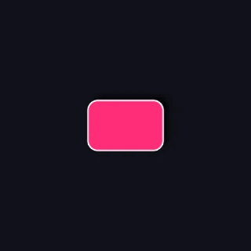 |  | 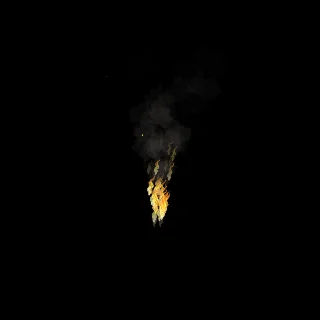 |
| Build shapes, paint, spaces, effects, and animation into a `canvas`. | Give a material its own lighting response and additional rendering operations through a `style`. | Combine an `emitter` with a surface that shades its simulated particles. |
| [Canvas example](#a-first-picture) | [Toon example](#surface-styles-toon-lighting-and-an-outline) | [Torch example](#particle-systems-simulated-flame-smoke-and-embers) |

`canvas` and `emitter` are engine-supplied authoring sugar: the bundled integration
registers these declaration names and defines the interfaces behind them. You can
extend or modify those contracts in your own integration layer, including their
inputs, configuration, hooks, and execution. Fresco supplies the general registration,
typechecking, and composition mechanisms; the engine supplies this vocabulary.

These examples use the same language at different levels. A canvas returns color.
A surface produces material properties such as albedo, roughness, and emission.
A style determines how those properties respond to lighting and can invoke extra
GPU work. An emitter defines particle spawning and updates; a surface gives those
particles their appearance.

The range extends beyond a single shader invocation. The
[MeadowFur example](<examples/40) surface shaders/style_sample_fur.fr>) computes a
density image and displaced shell vertices, reads the image during shading, and
draws lit translucent shells. Its resource dependencies connect preparation,
shading, and drawing into one technique the host can execute.

## How Fresco extends

**Content authors compose behavior.** Functions, shapes, layers, spaces, styles,
and reusable operations let you build vocabulary for a particular effect. A draw
or compute definition describes reusable work; a call supplies its inputs and
instantiates that work. Settings expose controls without requiring the host to
know the effect by name.

**Engine authors define the rendering environment.** Engine source declares
material schemas, typed contracts, shader hooks, capabilities, resources, vertex
factories, passes, and renderer pipelines. For example, the bundled engine defines
`standard` material properties and a `StandardStyle` contract. Toon implements
that contract and invokes its own outline draw for the current object/material
range. Forward, Forward+, and Deferred supply the renderer-specific resources and
integration boundaries. The compiler does not need built-in knowledge of Toon.

**The compiler connects the two.** It checks the selected content against the
engine's contracts, specializes shader code, and emits resource layouts and an
execution graph. That graph retains which operations produce and consume data,
which writes must be ordered, and where engine boundaries apply. Independent
compute can run before opaque rendering even when its result is used by a later
draw. The host supplies actual resources and executes the checked work.

This is the basis for extending Fresco to other engines and rendering techniques:
make the required inputs, capabilities, and scheduling relationships part of the
contract. The current implementation emits validated Naga IR, WGSL, and host
metadata; additional engine adapters and backend integration remain work to do.
The goal is reusable techniques with explicit requirements, while engines retain
control over their renderer and GPU resources.

## Why Fresco exists

Fresco starts from a frustration: HLSL and GLSL have evolved, but the basic way
we author shaders has stayed remarkably similar. We still translate an idea into
stage-local arithmetic and wire everything around it ourselves. Many material
systems put a friendlier face on that process, yet remain a layer over HLSL and
the assumptions of one particular engine. Fresco explores a different authoring
model, where the concepts behind an effect remain part of the program.

**Describe what you want to build, in the direction you think about building it.**
Make a shape, paint it, give it an outline, bend its space, and compose it with
other things. In a conventional fragment shader, that often means working backward
from an output pixel: undo the transforms, recover local coordinates, evaluate
distances, calculate coverage, and reconstruct the intended picture. Fresco lets
you state the construction and gives the compiler responsibility for that reverse
evaluation. A shape remains a shape, a space remains a space, and an effect retains
information about what it samples. The compiler can use those concepts to check,
combine, and optimize the work.

**A portable shader language is only part of a portable rendering technique.**
Shader code carries assumptions about the renderer, the meaning and layout of
resources, the output of earlier stages, and the work that must happen afterward.
A lighting function might be portable while its light lists, geometry preparation,
shadow inputs, blend state, and scheduling are tied to one engine. Those assumptions
usually live across shader files, material editors, engine code, and render-graph
setup. Understanding the technique means finding and mentally assembling all of
those pieces.

That fragmentation encourages vertical systems: each feature builds its own path
through the engine, with its own conventions and integration machinery. Getting
two techniques to cooperate can become a substantial project, even though their
work runs on the same GPU and contributes to the same frame. Fresco aims to make
those relationships explicit and composable. An engine declares its contracts,
resources, and extension points; authored content states the hooks it implements,
the capabilities it needs, and the operations it uses. The compiler can then check
how the pieces fit together and preserve their dependencies in the emitted work.

The ambition is for any engine to be able to integrate Fresco while retaining its
own rendering architecture. That requires shared language for the integration
contract as well as the shader math. It does not make every technique compatible
with every renderer: the required capabilities still have to exist. It makes those
requirements visible, so integrating a technique can become an explicit agreement
between content and engine instead of an exercise in uncovering hidden assumptions.
The bundled engine demonstrates that approach today; other engines need adapters
that fulfill their chosen contracts.

[Try the playground](https://azazel-labs.github.io/Fresco/) ·
[Language tour](#language-tour) · [How compilation works](#how-compilation-works) ·
[Run locally](#run-locally) · [Documentation](docs/README.md)

Release versions and bump commands are described in [Versioning](docs/versioning.md).

## Where Fresco fits

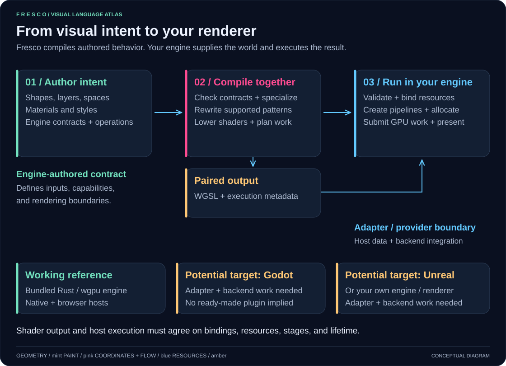

Integrate at the level you need: render a Canvas into a texture, connect authored
materials to your lighting path, or expose capabilities for compute and extra
draws. The bundled Rust/wgpu engine is the working reference. Godot and Unreal
are potential integration targets requiring adapter and backend work, not shipped
plugins. Explore the [visual integration guide](docs/visual-guide.md#where-fresco-fits)
or the [source-to-frame walkthrough](integrations/example-engine/README.md#read-the-integration-from-source-to-frame).

## A first picture

Start with the smallest case: a canvas that produces a picture. Here, `canvas` is
shorthand registered by the engine's `@entry(canvas, draw)` interface. The engine
supplies `CanvasContext` and the pass that calls `draw`; your integration can change
or extend that contract and its context. The compiler checks authored canvases
against the supplied interface.

This complete program introduces shapes, paint, spaces, and composition; the tour
then builds toward surfaces, styles, and particles:

<!-- readme:sample badge -->
```fresco
// The worked example from the design doc §12: a rotated space (the compiler
// emits the *inverse* rotation of the sample point), an analytic shadow
// (no blur pass), a fill, and a stroke — all folded into one expression,
// with the box's SDF evaluated once and shared (shape CSE).

canvas badge(ctx: CanvasContext) -> color {
    space stage = centered(aspect: preserve)
    let b = box(at: (0.5, 0.5), size: (0.30uv, 0.20uv)) |> round(0.04uv)

    compose {
        fill(#101018)

        in space stage {
            in space rotate(20deg/s) {
                compose {
                    b |> shadow(offset: (6px, 6px), soften: 12px, color: #000000aa)
                    b |> fill(#ff2d78)
                    b |> stroke(2px) |> fill(#ffffff)
                }
            }
        }
    }
}
```
<!-- readme:end -->

<!-- readme:preview -->

<!-- readme:preview-end -->

Read it from the inside out: a rounded box gets a shadow, pink fill, and white
outline. The layers are painted in order over a dark background. The whole group
rotates over time inside an aspect-preserving space.

`|>` passes a value into an operation. `stroke` produces an outline shape, so it
still needs `fill` to give it color. `px`, `uv`, and `deg` express units at the
point of use. The host supplies time and resolution; the compiler handles sample
coordinates, coverage, and composition.

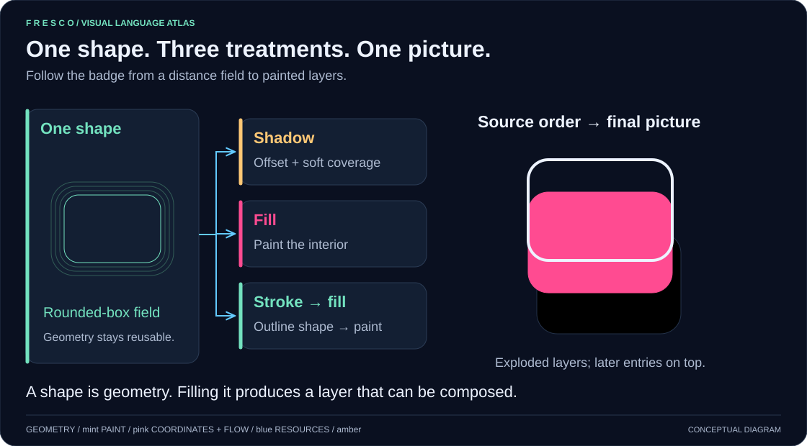

The separation above is explanatory; it does not imply separate GPU passes.

## Why Fresco is useful

Writing a procedural picture directly in a fragment shader means thinking from
the output pixel backward: undo transforms, evaluate distances, calculate
coverage, and blend contributions. Fresco lets the source follow the construction
of the picture while the compiler owns that inversion.

- **Change the design at the level you authored it.** Reuse one shape for its
  fill, border, and shadow. Change the shape once and those treatments follow.
- **Use spaces as a design tool.** Lay out a straight progress bar, then bend it
  into a dial with a polar space. Repeat a motif through a coordinate mapping.
- **Keep motion and controls in the source.** Declare a parameter with a default
  and range, or express a repeating signal with a period in seconds.
- **Let the compiler use the structure.** Recognized analytic effects can avoid
  intermediate images; shared shape evaluations can be reused. `--explain`
  reports rewrites and the resulting pass plan.
- **Keep the rendering contract explicit.** The output includes resource and
  stage metadata. Engines can supply renderer contracts in Fresco source, and
  hosts provide resources and execute the emitted stages.

The examples explore procedural UI, animated graphics, patterns, vector-like
artwork, and mesh materials. The broader language also has executable
engine-authored mesh and particle paths. These are useful working slices of an
actively developing compiler; the [current limits](#current-scope-and-limits)
are part of the contract.

## Language tour

The examples below are complete programs for the playground and its bundled engine.
The engine section explicitly labels its contract excerpt.

### Shapes, ink, and layers

A **shape** describes geometry. A **layer** describes a picture that can be
sampled and composed. Filling a shape turns it into a layer; `fill(color)` without
a shape paints the background. `compose` combines layers in source order, with
later entries above earlier ones under the default `over` blend.

Shape operators are union (`|`), intersection (`&`), and subtraction (`-`):

<!-- readme:sample cutout -->
```fresco
// Basic example: shape boolean operations.
// Shows union (`|`) and subtraction (`-`) with direct fills.

canvas shape_boolean_cutout(ctx: CanvasContext) -> color {
    space stage = centered(aspect: preserve)

    let frame_outer = box(at: (0.5, 0.5), size: (0.64, 0.42)) |> round(0.08)
    let frame_inner = box(at: (0.5, 0.5), size: (0.52, 0.30)) |> round(0.06)
    let frame = frame_outer - frame_inner

    let orbit_x = wave(period: 4s, shape: sine, range: 0.28 .. 0.72)
    let orb = circle(at: (orbit_x, 0.5), radius: 0.06)

    compose {
        fill(#0d1424)

        in space stage {
            frame |> fill(#60a5fa)
            (orb & frame_outer) |> fill(#f472b6)
        }
    }
}
```
<!-- readme:end -->

<!-- readme:preview -->

<!-- readme:preview-end -->

`center` is `(0.5, 0.5)`. Geometry is evaluated through distance fields, which
also provide useful structure for outlines and analytic effects. See the
[shape gallery](<examples/20) techniques/all_shapes_gallery.fr>) for more primitives.

### Parameters and gradients

`param` exposes a runtime value with a default and optional numeric range. The
manifest describes it for the host; the playground uses that information for
controls. `let` names an expression within the program.

<!-- readme:sample orb -->
```fresco
canvas orb(ctx: CanvasContext) -> color {
    param radius: f32 = 0.3 in 0.05 .. 0.45
    param accent: color = #ffb347

    compose {
        fill(#141827)
        circle(at: center, radius: radius) |> fill(gradient(
            kind: radial,
            center: center,
            radius: radius,
            stops: [
                stop(at: 0.0, color: #fff3bf),
                stop(at: 0.45, color: accent),
                stop(at: 1.0, color: #9a3412),
            ]
        ))
    }
}
```
<!-- readme:end -->

<!-- readme:preview -->
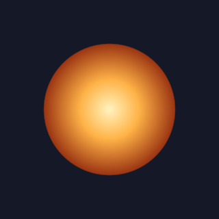
<!-- readme:preview-end -->

Linear gradients use `along: x`, `along: y`, or a direction vector in place of the
radial settings. Stop positions and colors can be expressions. Hex colors support
an alpha component, as in `#ffffff80`; `rgb(...)` and `rgba(...)` construct colors
from numeric values.

### Spaces: transform the composition

Fresco's canonical authored coordinates start at the bottom-left, with x pointing
right and y pointing up. Use `orientation(y: down)` to work with a top-left
convention. Declare a named space and use `in space` to apply it to a group.

<!-- readme:sample top_left -->
```fresco
canvas top_left(ctx: CanvasContext) -> color {
    space screen = orientation(y: down)
    compose {
        fill(#111827)
        in space screen {
            circle(at: (0.2, 0.2), radius: 0.08) |> fill(#ffd27a)
        }
    }
}
```
<!-- readme:end -->

<!-- readme:preview -->
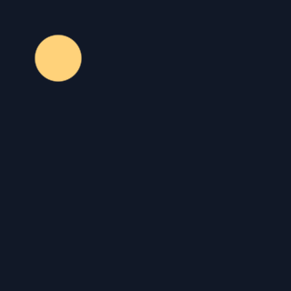
<!-- readme:preview-end -->

For a content transform such as rotation, the compiler maps the sample point
through the inverse transform before evaluating the contents. Nesting spaces
therefore transforms all the shapes and paint inside them together.

Spaces also express nonlinear mappings. Here the authored geometry is a straight
track and bar: x means progress around a turn, and y means radius. `polar` bends
both into a ring.

<!-- readme:sample dial -->
```fresco
canvas dial(ctx: CanvasContext) -> color {
    param progress: f32 = 0.72 in 0 .. 1
    space stage = centered(aspect: preserve)
    space dial_space = polar(center: center, from: -90deg, direction: clockwise)
    let track = box(at: (0.5, 0.32), size: (1.0, 0.045))
    let bar = box(at: (progress / 2, 0.32), size: (progress, 0.045))

    compose {
        fill(#0d1117)
        in space stage {
            in space dial_space {
                compose {
                    track |> fill(#ffffff20)
                    bar |> fill(#4facfe)
                }
            }
        }
    }
}
```
<!-- readme:end -->

<!-- readme:preview -->

<!-- readme:preview-end -->

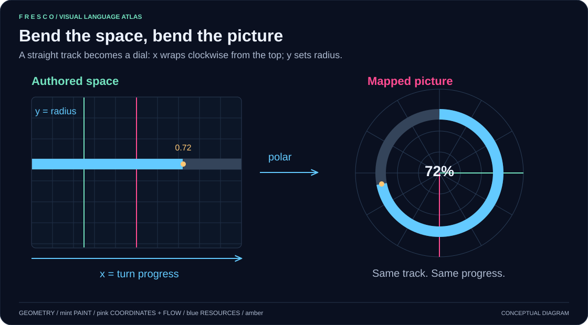

The [full progress ring](<examples/90) gallery/progress_ring.fr>) adds rounded
ends, wraparound copies, tick marks, a gradient, and an animated tip. Units inside
a warped space need care: a local distance is not automatically a screen-pixel
distance after the warp.

### Perspective card flip

Perspective spaces can turn a flat composition around the x and y axes. This
card selects its front or back face from the rotation angle, then transforms
that face as a group. The rotation takes four seconds; the front decoration
pulses twice per turn so the animation loops seamlessly.

<!-- readme:sample perspective_flip_card -->
```fresco
// Perspective card flip: one turn and two pulses every four seconds.

canvas perspective_flip_card(ctx: CanvasContext) -> color {
    let time = context(time)
    let flip = time * 90deg
    let pulse = wave(period: 2s, shape: sine, range: 0.35 .. 0.85)
    space stage = centered(aspect: preserve)

    let front_base = box(at: center, size: (0.42, 0.58)) |> round(0.035)
    let front_face = front_base

    let back_base = box(at: center, size: (0.42, 0.58)) |> round(0.035)
    let stripe_a = box(at: (0.5, 0.38), size: (0.30, 0.04)) |> round(0.01)
    let stripe_b = box(at: (0.5, 0.46), size: (0.30, 0.04)) |> round(0.01)
    let stripe_c = box(at: (0.5, 0.54), size: (0.30, 0.04)) |> round(0.01)

    compose {
        fill(gradient(
            along: y,
            stops: [
                stop(at: 0.0, color: #101827),
                stop(at: 1.0, color: #1f2f46),
            ]
        ))

        // Hard side switch (no cross-fade): dynamic branch selects one face path.
        if cos(flip) >= 0.0 {
            // Front face in its own rotating space.
            in space stage
                .perspective(fov: 58deg, near: 0.02, far: 12.0, origin: center)
                .rotate_x(angle: -8deg, around: center)
                .rotate_y(angle: flip, around: center)
                .translate3(x: 0.0, y: 0.0, z: 0.03) {
                compose {
                    front_face |> fill(#f8fafc)
                    circle(at: (0.5, 0.36), radius: 0.055 * pulse) |> fill(#5eead4)
                    star(at: (0.5, 0.62), outer: 0.06, inner: 0.028, points: 5) |> fill(#f59e0b)
                }
            }
        } else {
            // Back face rendered as a separate plane rotated 180deg from the front.
            in space stage
                .perspective(fov: 58deg, near: 0.02, far: 12.0, origin: center)
                .rotate_x(angle: -8deg, around: center)
                .rotate_y(angle: flip + 180deg, around: center)
                .translate3(x: 0.0, y: 0.0, z: 0.03) {
                compose {
                    back_base |> fill(#0f766e)
                    stripe_a |> fill(#99f6e4)
                    stripe_b |> fill(#99f6e4)
                    stripe_c |> fill(#99f6e4)
                }
            }
        }
    }
}
```
<!-- readme:end -->

<!-- readme:preview -->

<!-- readme:preview-end -->

These are projected flat layers. The face selection is explicit; the example
does not require a solid mesh or a depth buffer. See the
[shared gallery source](<examples/90) gallery/perspective_flip_card.fr>) to edit the
same card used by Fresco Lab and this preview.

### Motion and repetition

A signal expresses a value that changes with time. `wave` can give motion a period,
shape, range, and phase without spelling out the trigonometry.

<!-- readme:sample dots -->
```fresco
// Demonstrates generic 2-D repeat syntax via `repeat(every: (x, y))`.
// The parser desugars this onto the existing repeat-space lowering.

canvas repeat_grid_dots(ctx: CanvasContext) -> color {
    let bob = wave(period: 2.4s, shape: sine, range: -0.01 .. 0.01)

    compose {
        fill(#101827)

        in space repeat(every: (0.16, 0.16)) {
            circle(at: (0.08, 0.08 + bob), radius: 0.035)
            |> fill(#5eead4)
        }
    }
}
```
<!-- readme:end -->

<!-- readme:preview -->

<!-- readme:preview-end -->

The repeated motif is expressed once. The repeat space remaps sample coordinates
into a cell; it does not need a separately authored circle for every dot.

For a finite collection with distinct values, use a compile-time array and a
bounded loop:

<!-- readme:sample bars -->
```fresco
// Demonstrates compile-time array comprehensions and `for`-loop unrolling.
// The loop iterates over a compile-time array of bar steps rather than a runtime collection.

canvas for_loop_bars(ctx: CanvasContext) -> color {
    let steps = [for i in 0 .. 7 => i]
    let pulse = wave(period: 2.8s, shape: sine, range: 0.92 .. 1.08)

    compose {
        fill(#0e1420)

        for step in steps {
            let p = step / 6.0
            let x = 0.14 + p * 0.72
            let h = (0.16 + p * 0.40) * pulse
            let bar = box(at: (x, 0.12 + h / 2), size: (0.07, h)) |> round(0.012)

            bar |> fill(gradient(
                along: y,
                anchor: shape,
                stops: [
                    stop(at: 0.0, color: #17345c),
                    stop(at: 1.0, color: #5eead4),
                ]
            ))
        }

        box(at: (0.5, 0.11), size: (0.82, 0.002)) |> fill(#334155)
    }
}
```
<!-- readme:end -->

<!-- readme:preview -->

<!-- readme:preview-end -->

This loop is unrolled from a compile-time collection. `scatter` supplies another
model for finite placements, with seeded distribution and per-instance values;
see [scatter motion and phase](<examples/10) fundamentals/scatter_index_phase.fr>).
That procedural placement model is distinct from the engine's stateful particle
buffer and compute dispatch.

### Effects, blending, and cost

Effects operate on meaningful inputs. A shadow can use a shape's distance field;
a general image operation may need neighboring samples or an intermediate image.

<!-- readme:sample haze -->
```fresco
// Basic example: blur-over-fill rewrite path (`blur ∘ fill => soften`).
// Run with `--explain` to see the rewrite receipt.

canvas blur_soften_haze(ctx: CanvasContext) -> color {
    space stage = centered(aspect: preserve)
    let blob = circle(at: (0.5, 0.5), radius: 0.16)

    compose {
        fill(#0b1220)

        in space stage {
            blob |> fill(#ffb266) |> blur(0.10) |> blend(screen)
            blob |> fill(#ffd7aa)
        }
    }
}
```
<!-- readme:end -->

<!-- readme:preview -->
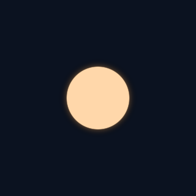
<!-- readme:preview-end -->

For the recognized `shape |> fill(...) |> blur(...)` pattern, the compiler has an
analytic soften rewrite. Inspect it with `--explain`. This does not imply that
arbitrary image blur is free or that every effect stack becomes one pass.

`blend(add)`, `blend(screen)`, and `blend(multiply)` make composition choices
explicit. Fresco also supports user-defined effects with locality declarations
and composition rewrite rules; the [rewrite contracts](TODO.md#rewrite-contracts-and-follow-up)
explains their matching and safety constraints.

### Functions and reusable expressions

Ordinary functions express reusable calculations. Callable parameters allow a
function to accept another function:

<!-- readme:sample functions -->
```fresco
// Fundamentals: callable parameter (`fn(T)->R`) and function reference passing.

fn double(x: f32) -> f32 {
    return x * 2.0
}

fn apply(f: fn(f32)->f32, x: f32) -> f32 {
    return f(x)
}

canvas callable_parameter_basics(ctx: CanvasContext) -> color {
    let uv = context(coord)
    let r = apply(double, uv.x) * 0.25
    compose {
        circle(at: center, radius: r) |> fill(#7fd1ff)
    }
}
```
<!-- readme:end -->

<!-- readme:preview -->
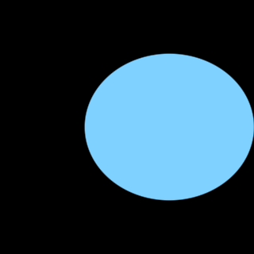
<!-- readme:preview-end -->

The [fundamentals](<examples/10) fundamentals>) also demonstrate generic type
parameters, interface bounds, enums, parameter arrays, and vector operations.
Newlines separate statements and composition entries. The tour uses the supported
leading `|>` form when continuing a pipeline onto another line.

### Textures and explicit sampling

A texture is a host-supplied resource. `.at(...)` makes the sample coordinate
explicit:

<!-- readme:sample textured -->
```fresco
canvas textured(ctx: CanvasContext) -> color {
    let uv = context(coord)
    [binding(default = "assets/textures/brick_tex.png")]
    uniform image: texture
    compose {
        image.at(uv)
        circle(at: center, radius: 0.2) |> stroke(2px) |> fill(#ffffff)
    }
}
```
<!-- readme:end -->

<!-- readme:preview -->
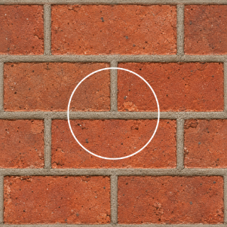
<!-- readme:preview-end -->

This program needs the host to bind `image` before rendering. The
[image texture example](<examples/20) techniques/image_texture.fr>) adds a
playground asset binding and color processing. Texture sampling belongs to the
program; loading assets and supplying GPU textures belongs to the host.

### Mesh materials

A `surface` evaluates material properties using surface inputs such as mesh UVs:

<!-- readme:sample uv_material -->
```fresco
surface uv_material(sp: surf) -> material(unlit) {
    let uv = sp.uv
    compose {
        base(albedo: rgba(uv.x, uv.y, 1.0 - uv.x, 1.0))
    }
}
```
<!-- readme:end -->

<!-- readme:preview -->
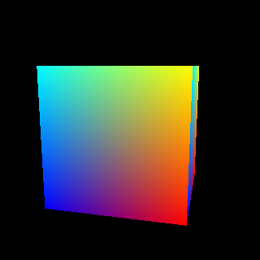
<!-- readme:preview-end -->

Render this with the playground's engine profile and mesh preview. A material
provides properties; an engine pass determines how those properties become a
rendered result. The [surface examples](<examples/40) surface shaders>) include
texture-based materials, procedural UV debugging, and vertex displacement.

### Surface styles: Toon lighting and an outline

A material supplies values such as albedo and roughness. A `style` defines how
those values respond to lighting and can invoke reusable `draw` or `compute`
operations. The engine declares the typed hooks, capabilities, resources, and
integration boundaries in a `contract`.

The [Toon sample](<examples/40) surface shaders/style_sample.fr>) defines both its
lighting response and an inverted-hull outline. `for self` scopes the extra draw
to the current object/material range. Passing `opaque.color` and `opaque.depth`
selects the engine's completed-opaque boundary; the compiler checks that the
outline finishes before transparency, inspection, and presentation. Defining the
operation alone schedules no work.

<!-- readme:sample toon -->
```fresco
// An externally authored style for existing standard materials. Change
// properties.style to StandardGGX to use the engine default response instead.
// The selected implementation also contributes an inverted-hull mesh draw.
// The renderer supplies separate light inputs; the style chooses their weighting.
style Toon for standard : StandardStyle {
    param outline_width: f32 in [0.0, 10.0] = 2.5
    param outline_color: color = #2e1938
    static param outline_enabled: bool = true
    for self {
        static if outline_enabled {
            InvertedHull(geometry: mesh.prepared, view: frame, width: outline_width, ink: outline_color,
                         color: opaque.color, depth: opaque.depth)
        }
    }
    param band_threshold: f32 in [0.05, 0.55] = 0.25
    param highlight_strength: f32 in [0.0, 2.0] = 1.0
    fn direct(surface: StandardSurface, context: ShadingContext, light: DirectLight) -> vec3 {
        let albedo = surface.albedo
        let roughness = surface.roughness
        let metallic = surface.metallic
        let n = surface.normal
        let v = context.view_direction
        let l = light.direction
        let nl = dot(n, l)
        // Diffuse bands depend on light direction, including at grazing view angles.
        if nl <= 0.0 { return vec3(0.0) }
        let bands = smoothstep(0.0, 0.04, nl) * (0.15 + 0.35 * smoothstep(band_threshold - 0.02, band_threshold + 0.02, nl) + 0.5 * smoothstep(0.63, 0.67, nl))
        let h = (v + l) * inverse_sqrt(max(dot(v + l, v + l), 0.00000001))
        let highlight = smoothstep(0.55, 0.65, pow(max(dot(n, h), 0.0), mix(96.0, 4.0, roughness)))
        return (albedo * (1.0 - metallic) * bands / 3.14159265 + mix(vec3(0.04), albedo, metallic) * highlight * highlight_strength)
             * light.radiance * light.attenuation * light.visibility
    }
    fn indirect(surface: StandardSurface, context: ShadingContext, light: IndirectLight) -> vec3 {
        return (surface.albedo * (1.0 - surface.metallic)
             + mix(vec3(0.04), surface.albedo, surface.metallic) * light.specular_fill)
             * light.irradiance * surface.occlusion
    }
}

// Reusable operation: defining it alone schedules no work.
draw InvertedHull(geometry: PreparedMesh, view: PreviewScene, width: f32, ink: color,
                  color: attachment<rgba16float, preserve_update>, depth: attachment<depth32float, test_only>) {
    requires material.blend == SurfaceBlend.Opaque && material.two_sided == false
    raster geometry
    visibility: uncullable
    cull: front
    blend { all: replace }
    depth { write: false; compare: less_equal }
    attachments { color: load_store; depth: load_store }
    @vertex fn shell(index: u32) -> clip_position {
        let v = geometry.vertices[index]
        var projected = view.proj * view.view * vec4(v.world_position, 1.0)
        let view_normal = (view.view * vec4(v.geometric_normal, 0.0)).xyz
        let direction = (view.proj * vec4(view_normal, 0.0)).xy * view.res
        let length_squared = dot(direction, direction)
        if length_squared > 0.000001 && projected.w > 0.0 {
            let offset = direction * inverse_sqrt(length_squared) * 2.0 * width / view.res
            projected.x += offset.x * projected.w
            projected.y += offset.y * projected.w
        }
        return projected
    }
    @fragment fn fragment() -> vec4 { return ink }
}

surface style_sample(sp: surf) -> material(standard) {
    properties { style: Toon }
    param tint: color = #f5ad69
    param roughness_level: f32 = 0.45
    param metallic_level: f32 = 0.0
    param glow: f32 = 0.0
    compose {
        base(albedo: tint, roughness: clamp(roughness_level, 0.045, 1.0),
             metallic: clamp(metallic_level, 0.0, 1.0), emissive: tint.rgb * max(glow, 0.0))
    }
}
```
<!-- readme:end -->

<!-- readme:preview -->

<!-- readme:preview-end -->

The same style works in the example engine's Forward, Forward+, and Deferred
renderers. Runtime parameters update through reflected settings; static parameters
select graph structure at compilation. Unsupported material or renderer capabilities
produce diagnostics.

For a different use of the same contracts, [MeadowFur](<examples/40) surface shaders/style_sample_fur.fr>)
computes a density image and shell vertices, binds the image into shading, and
submits lit translucent shells to the engine's sorted transparency queue. Compute
runs from its own resource dependencies, so a later draw boundary does not force
independent preparation to wait. Explicit `at point as target` placement remains
available. See [styles and operations](LANGUAGE.md#styles-and-reusable-operations)
for the language contract and [the completed implementation checklist](docs/standard-shading-styles-design.md)
for validation and limits.

### Particle systems: simulated flame, smoke, and embers

`emitter` is authoring sugar registered by the engine's particle integration. Its
`spawn` and `update` blocks, configuration, and particle state come from that
integration's contract. You can extend or modify them in your own integration,
along with the simulation and drawing stages that execute them. Fresco checks the
registered interface and composes the authored behavior. A separate `surface`
shades the particles, including their age, lifespan, ID, and velocity.
The [torch sample](<examples/50) particles/torch.fr>) uses one emitter for three
particle families, with separate textures, motion, and fading. The engine runs
GPU simulation and renders the resulting billboards.

<!-- readme:sample torch -->
```fresco
// A torch built from individual simulated flame tongues, smoke puffs, and embers.
// One bounded emitter selects three particle families by stable birth ID.
fn torch_random(id: f32, salt: f32) -> f32 {
    return fract(sin(id * 127.1 + salt * 311.7) * 43758.5453)
}

fn torch_spawn<T>(p: T, id: f32) -> T {
    let family = torch_random(id, 1.0)
    let r = torch_random(id, 2.0)
    let angle = torch_random(id, 3.0) * 6.2831853
    var next = p
    next.position = vec4(cos(angle) * 0.055, -0.65, sin(angle) * 0.055, 0.0)
    if family < 0.62 {
        next.lifespan = 0.45 + r * 0.4
        next.velocity = vec4(cos(angle) * 0.12, 0.65 + r * 0.5, sin(angle) * 0.12, 0.0)
        next.position.w = 0.46
    } else if family < 0.9 {
        next.lifespan = 1.4 + r * 1.1
        next.position.y = -0.3
        next.velocity = vec4(cos(angle) * 0.1, 0.4 + r * 0.2, sin(angle) * 0.1, 0.0)
        next.position.w = 0.28
    } else {
        next.lifespan = 0.7 + r * 1.0
        next.velocity = vec4(cos(angle) * 0.4, 0.9 + r * 0.7, sin(angle) * 0.4, 0.0)
        next.position.w = 0.075
    }
    return next
}

fn torch_motion<T>(p: T, dt: f32) -> T {
    let family = torch_random(p.id, 1.0)
    let life = clamp(p.age / max(p.lifespan, 0.001), 0.0, 1.0)
    let phase = torch_random(p.id, 4.0) * 6.2831853
    var next = p
    if family < 0.62 {
        next.velocity.x += sin(p.age * 9.0 + phase) * 0.65 * dt
        next.velocity.z += cos(p.age * 7.0 + phase) * 0.45 * dt
        next.position.w = mix(0.46, 0.2, life)
    } else if family < 0.9 {
        next.velocity.x += (0.10 + sin(p.age * 2.0 + phase) * 0.13) * dt
        next.velocity.y += 0.08 * dt
        next.position.w = mix(0.28, 0.85, life)
    } else {
        next.velocity.y -= 0.65 * dt
        next.position.w = mix(0.075, 0.025, life)
    }
    next.position = vec4(p.position.xyz + next.velocity.xyz * dt, next.position.w)
    return next
}

emitter torch_system {
    spawn_rate: 95.0
    burst_count: 12
    max_lifespan: 2.5
    spawn { torch_spawn(id) }
    update { torch_motion(dt) }
}

texture_type TorchSprite {
    r: red
    g: green
    b: blue
    a: alpha
}

surface torch(sp: surf) -> material(unlit) {
    properties {
        blend: SurfaceBlend.Translucent
        two_sided: true
    }
    param flame_tex: texture<TorchSprite> = "assets/particles/torch_flame.png"
    param smoke_tex: texture<TorchSprite> = "assets/particles/torch_smoke.png"
    param ember_tex: texture<TorchSprite> = "assets/particles/torch_ember.png"
    param flame_intensity: f32 = 1.5 in 0.2 .. 3.0
    param smoke_opacity: f32 = 0.18 in 0.0 .. 0.5
    param ember_intensity: f32 = 2.0 in 0.2 .. 4.0

    let life = clamp(sp.particle_age / max(sp.particle_lifespan, 0.001), 0.0, 1.0)
    let family = torch_random(sp.particle_id, 1.0)
    let phase = torch_random(sp.particle_id, 4.0) * 6.2831853
    let fade = smoothstep(0.0, 0.12, life) * (1.0 - smoothstep(0.45, 1.0, life))
    // File textures are top-left oriented; billboard UVs are bottom-left oriented.
    let uv = vec2(sp.uv.x, 1.0 - sp.uv.y)
    let spin = phase + sp.particle_age * 0.25
    let q = uv - vec2(0.5)
    let smoke_uv = vec2(cos(spin) * q.x - sin(spin) * q.y,
                        sin(spin) * q.x + cos(spin) * q.y) + vec2(0.5)
    // Sample all inputs uniformly; avoid derivative-based sampling in divergent branches.
    let flame = flame_tex.at(uv)
    let smoke = smoke_tex.at(clamp(smoke_uv, vec2(0.0), vec2(1.0)))
    let ember = ember_tex.at(uv)
    let flame_color = rgba(flame.red * flame_intensity, flame.green * flame_intensity, flame.blue * flame_intensity, flame.alpha * fade * 0.65)
    let smoke_color = rgba(smoke.red * 0.38, smoke.green * 0.36, smoke.blue * 0.34, smoke.alpha * fade * smoke_opacity)
    let ember_color = rgba(ember.red * ember_intensity, ember.green * ember_intensity, ember.blue * ember_intensity, ember.alpha * fade)
    let ink = family < 0.62 ? flame_color : (family < 0.9 ? smoke_color : ember_color)
    compose {
        base(albedo: ink)
    }
}
```
<!-- readme:end -->

<!-- readme:preview -->

<!-- readme:preview-end -->

The preview is a repeating capture of a running simulation, not a seamless
periodic effect. Open the sample in the playground to change its spawn rate,
textures, flame intensity, and smoke opacity.

## How compilation works

```text
Fresco source (.fr), with engine source when supplied
    -> lexer and parser: source-spanned syntax
    -> semantic checking: typed shapes, layers, functions, and contracts
    -> rewrites and planning: analytic simplification, locality, pass structure
    -> lowering: coordinate evaluation, composition, resources, shader stages
    -> Naga IR and validation
    -> WGSL + host manifest
```

A GPU shader computes the value at a sample. Fresco's forward-looking source must
therefore become a backward evaluation: map the sample into the right space,
evaluate the relevant geometry and paint, and combine the layers. The compiler
builds Naga IR directly rather than generating WGSL strings as its intermediate
representation.

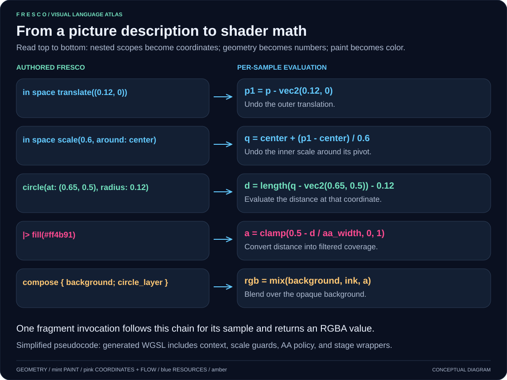

Follow the [source-to-shader walkthrough](docs/visual-guide.md#from-authored-code-to-shader-evaluation)
for a compilable example and generated WGSL excerpt. The visual guide also
explains [fields](docs/visual-guide.md#fields-a-number-at-every-coordinate) and
[nested spaces](docs/visual-guide.md#how-nested-spaces-compound).

Keeping a typed graph before lowering makes several decisions possible:

- Match analytic rewrites while shapes and effects are still recognizable.
- Track locality: whether an operation needs only this point, a neighborhood,
  or broader input.
- Reuse shape evaluations when both geometry and sample coordinates agree.
- Specialize supported compile-time choices and emit the corresponding stages.

`--explain` reports rewrite decisions, locality, pass structure, and shape reuse.
Use it to inspect what a composition costs, alongside the generated shader;
it is not a GPU timing measurement.

The **manifest** describes parameters, resources, layouts, pass information, and
supported executable stage entries. Treat it and the WGSL as a matched pair from
the same source and compiler configuration. The host uploads values, binds
resources, selects variants where required, and schedules draws or dispatches.
See [engine integration](LANGUAGE.md#host-integration-obligations) for the ABI details.

## Engines can author the rendering contract

Canvas is one application of the language. Engines define
interfaces, resources, vertex factories, passes, and pipelines in `.fr` source,
then check and specialize authored content against those declarations.

For example, this is an excerpt from the shipped
[fullscreen engine bundle](integrations/example-engine/engine/core/04_canvas_contract.fr):

<!-- readme:sample canvas_contract -->
```fresco
// The engine owns the canvas argument and its semantic providers.
struct CanvasContext {
    @semantic(coord) uv: vec2
    frame: FrameGlobals
}
struct ScreenVarying {
    clip_pos: vec4
    uv: vec2
}

struct CanvasViewConfig {
    @config(editor) zoom: f32 = 1.0
    @config(editor) pan: vec2 = vec2(0.0, 0.0)
}

@entry(canvas, draw)
interface Canvas {
    fn draw(@context ctx: CanvasContext) -> color
}

pass present_canvas for Canvas {
    stage: raster
    draw: fullscreen

    binding {
        @group(frame) frame: uniform<FrameGlobals>
    }

    fn vertex(vertex_id: u32) -> ScreenVarying {
        let p = fullscreen_triangle_position(vertex_id)
        return ScreenVarying(
            clip_pos: vec4(p, 0.0, 1.0),
            uv: p * 0.5 + vec2(0.5, 0.5))
    }

    fn shade(v: ScreenVarying, t: Canvas) -> color {
        let ctx = CanvasContext(uv: v.uv, frame: frame)
        return t.draw(ctx)
    }
}

pipeline canvas_pipeline for Canvas {
    present_canvas
}
```
<!-- readme:end -->

The surrounding bundle supplies `FrameGlobals` and the fullscreen triangle helper.
An interface states what content must provide; the pass supplies executable
vertex and shade behavior; the pipeline selects the pass. The compiler validates
the contract and specializes its calls for each canvas instance.

The shipped paths now include:

| Path | Compiler and host behavior |
| --- | --- |
| Fullscreen | Authored vertex/shade hooks, emitted entries and bindings, compile-time variants with explicit host selection |
| Surfaces and styles | Typed engine contracts, lighting hooks, per-range draw/compute operations, resource-driven scheduling, and Forward/Forward+/Deferred execution |
| Particles | Authored simulation and draw hooks, bounds-checked compute, shared state buffer with separate compute/render access layouts |

[Hardware GPU tests](crates/fresco-wasm/web/tests/gpu/README.md) cover authored hook
edits changing rendered pixels, variant selection, and existing canvas behavior.
The [language reference](LANGUAGE.md) documents the implemented contracts; the
[active roadmap](TODO.md) tracks remaining work.

### Integrating an engine, from source files to a draw

An engine integration has two parts: **Fresco source describes the rendering
contract; host code supplies resources and executes it.** Ship the engine's `.fr`
files alongside the content being compiled. A material or canvas author can then
use the interfaces, types, and helpers that engine exposes.

The [example engine package](integrations/example-engine/README.md) contains the
authored engine sources, an embedded Rust source-bundle API, integration tests,
and a first Rust canvas renderer with a local offscreen probe and
[native and standalone browser hosts](integrations/example-engine-host/README.md).
The remaining rendering paths and playground migration are still in progress. Its
[engine entry](integrations/example-engine/engine/engine.fr) organizes the contract
into these files:

| Source | What the engine supplies |
| --- | --- |
| [00_prelude.fr](integrations/example-engine/engine/core/00_prelude.fr) | `FrameGlobals`, the frame parameter, and time/resolution accessors |
| [01_core.fr](integrations/example-engine/engine/core/01_core.fr), [02_functions.fr](integrations/example-engine/engine/core/02_functions.fr), [03_payload.fr](integrations/example-engine/engine/core/03_payload.fr) | Shared types, interfaces, functions, and payload declarations |
| [04_canvas_contract.fr](integrations/example-engine/engine/core/04_canvas_contract.fr) | The fullscreen interface, executable pass, and pipeline shown above |
| [05_mesh_contract.fr](integrations/example-engine/engine/core/05_mesh_contract.fr) | Mesh vertex factory, scene resource, material pass, and particle simulation/draw contracts |
| [pipelines/](integrations/example-engine/engine/pipelines) | Additional forward and deferred pipeline declarations; execution support remains subject to the engine execution limits |

**1. Compile content with the engine bundle.** For a file-based example, this
complete program imports the provided engine and supplies a canvas instance:

<!-- readme:sample engine -->
```fresco
// The host selects the example engine contract explicitly.

canvas engine_sample(ctx: CanvasContext) -> color {
    compose {
        circle(at: center, radius: 0.25) |> fill(#ff2d78)
    }
}
```
<!-- readme:end -->

<!-- readme:preview -->
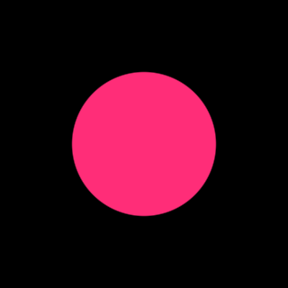
<!-- readme:preview-end -->

Run it from the repository root:

```sh
cargo run -p fresco-cli -- "examples/10) fundamentals/engine_canvas.fr" --engine-dir integrations/example-engine/engine -o engine-sample.wgsl
cargo run -p fresco-cli -- "examples/10) fundamentals/engine_canvas.fr" --engine-dir integrations/example-engine/engine --emit manifest -o engine-sample.manifest.json
```

Keep canvas/surface instances in the entry file; imported modules provide reusable
declarations. The relative import above is specific to this example's location.
Your engine can package its own bundle under its own paths.

**2. Supply virtual files when embedding the compiler.** The browser does not
need a filesystem. The WASM API accepts an object mapping paths to source text,
plus the entry-file path. After initializing the WASM module, an integration can
call it like this, where `engineFiles` contains every file from the engine bundle
under `engine/`, and `userSource` contains the authored canvas or surface:

```js
const files = {
    ...engineFiles,
    "main.fr": 'import "engine/engine.fr"\n' + userSource,
};
const result = compile_fresco_bundle(files, "main.fr", true);
if (!result.ok) {
    // Display result.diagnostics, including source paths and spans.
    return;
}
const { wgsl, manifest, explain } = result;
```

Supply imported dependencies as source strings too; a virtual path is a lookup
key, not a URL the compiler fetches. Native Rust hosts use
`fresco::driver::compile_bundle_virtual(&files, entrypoint, include_explain)` with
a `HashMap<String, String>`. Its manifest is JSON text; the WASM wrapper returns
the parsed object.

The playground's [runtime content registry](crates/fresco-wasm/web/src/runtime-content-registry.ts)
shows how the provided engine files are packaged and added to compilation bundles.
Its [compile worker](crates/fresco-wasm/web/src/compile-worker.ts) calls the WASM API.

**3. Build GPU resources and pipelines from the result.** Create the shader module
from `wgsl` and consume its matching `manifest`. For a canvas, use `engine_pass`
for vertex/fragment entries, vertex count, and any required variant selection.
For surfaces and particles, consume the selected renderer recipe, `gpu_programs`,
techniques, and reflected vertex/resource layouts. These describe executable draws,
compute dispatches, dependencies, and bindings. Allocate and bind resources using
that metadata rather than guessing offsets or entry names.

**4. Supply changing values and execute.** Upload instance parameters and engine
uniforms before rendering. The shipped [host](integrations/example-engine-host)
supplies frame time, delta time, camera state, and viewport resolution; a custom
engine provides its own values. The host also owns textures, mesh buffers,
particle state, render targets, and scheduling. For particles, dispatch simulation
before drawing with the separate compute/render access layouts.

The shared [Rust/wgpu host](integrations/example-engine-host) consumes that metadata
for native and browser execution. The playground uses its
[browser adapter](crates/fresco-wasm/web/src/preview/example-engine-renderer.ts). Changing an authored engine hook and
recompiling changes the emitted shader; changing a runtime uniform only requires
an upload. See the [integration reference](LANGUAGE.md#host-integration-obligations) for binding
details and host obligations.

## Run locally

### Compile a program

Use Rust through rustup; [rust-toolchain.toml](rust-toolchain.toml) pins the
workspace toolchain. Run these commands from the repository root:

```sh
cargo build --release -p fresco-cli
cargo run -p fresco-cli -- "examples/10) fundamentals/badge.fr" --engine-dir integrations/example-engine/engine -o badge.wgsl
cargo run -p fresco-cli -- "examples/10) fundamentals/badge.fr" --engine-dir integrations/example-engine/engine --emit manifest -o badge.manifest.json
cargo run -p fresco-cli -- "examples/10) fundamentals/blur_soften_haze.fr" --engine-dir integrations/example-engine/engine --explain
```

The CLI compiles shaders; it does not open a rendering window. Use the playground
for a live preview, or integrate the output into a host. `--emit ir` dumps Naga IR,
`--timings` reports compiler timings, and `fmt` formats Fresco files:

```sh
cargo run -p fresco-cli -- fmt examples --check
```

Formatting uses four-space indentation and separates properties, parameter, and
compose sections with blank lines. Standalone calls that exceed 100 characters
or already wrap after an argument use one argument per line, with the closing
parenthesis on its own line. Short calls and nested argument expressions stay
compact. Calls containing line comments retain their layout.

### Run the playground

Install Node.js/npm and `wasm-pack`, and use a browser with WebGPU available.
The repository toolchain includes the `wasm32-unknown-unknown` target.

```sh
cargo install wasm-pack
cargo xtask lang-docs
cd crates/fresco-wasm/web
npm ci
npm run dev
```

The development script syncs examples, builds the WASM compiler, and starts Vite.
Open the local URL it prints to edit code in Monaco and inspect the preview.
`npm run build` produces a production web bundle.

### Explore the examples

| Example | What to look for |
| --- | --- |
| [Badge](<examples/10) fundamentals/badge.fr>) | One shape reused for fill, border, and shadow inside a rotating space |
| [Sunset](<examples/10) fundamentals/sunset.fr>) | Gradients, analytic effects, and ordered composition |
| [Progress ring](<examples/90) gallery/progress_ring.fr>) | A straight design bent into a dial |
| [Repeat grid](<examples/10) fundamentals/repeat_grid_dots.fr>) | Coordinate repetition with animated contents |
| [Scatter phase](<examples/10) fundamentals/scatter_index_phase.fr>) | Seeded instances with individual motion phases |
| [Bar chart](<examples/20) techniques/bar_chart.fr>) | Data-driven procedural graphics |
| [Neon sign](<examples/90) gallery/neon_sign.fr>) | Layered outlines and glow |
| [UV debug material](<examples/40) surface shaders/uv-debug-procedural.fr>) | Procedural color on a mesh surface |
| [Toon style](<examples/40) surface shaders/style_sample.fr>) | Custom lighting and a range-scoped inverted-hull draw |
| [Meadow fur](<examples/40) surface shaders/style_sample_fur.fr>) | Compute-generated resources and lit transparent shells |
| [Torch](<examples/50) particles/torch.fr>) | GPU-simulated flames, smoke, and embers |
| [Engine contracts](integrations/example-engine/engine/core/05_mesh_contract.fr) | Executable mesh and particle hooks |

## Current scope and limits

The compiler and playground implement the examples above, but the full language
design is broader than today's execution support.

- Typed styles, declared render state, reusable draw/compute operations, and
  resource-driven placement are implemented. Their available resources and hooks
  come from the selected engine contract. A new renderer must provide and validate
  that contract; arbitrary engines are not automatically compatible.
- Style compute outputs are invocation-scoped transient resources. Persistent
  history and host readback remain outside this operation model.
- Fullscreen compile-time axes execute as specialized variants. Pipeline-time
  and draw-time fullscreen axes still need their resource/update ABI.
- General pass partitioning, feedback, sampled spaces, and lowering scalability
  remain active work areas. Check the supported operation and emitted plan rather
  than assuming an arbitrary effect stack has an efficient execution path.
- Hosts must honor reflected resource layouts and supported execution plans.
  Uniforms retain their declared scalar encoding; offsets and alignment come from
  reflection, not an assumption that every value is a packed float.
- User rewrite matching is limited; guards must fold at compile time, and numeric
  self-verification is not implemented.

The host requires current executable metadata; the legacy style adapters and
browser fallback paths have been retired.
See the [active roadmap](TODO.md) for priorities and the
[GPU regression guide](crates/fresco-wasm/web/tests/gpu/README.md) for execution checks.

## Working on Fresco

README Fresco blocks are generated from [shared Lab examples](examples), selected
by the [sample manifest](docs/readme/samples.json). Edit the example once to update
both Lab and its README snippet, then run:

```sh
cargo xtask readme-sync
```

The command compiles the samples, including an engine-bundle harness, and fixes
stale README blocks automatically. Both `cargo xtask ci` and `cargo xtask ci-strict`
run this update too. Missing sources, malformed markers, unmanaged Fresco blocks,
and compilation errors still fail. An optional `--check` mode provides a read-only
drift check when explicitly requested. The native CI job runs this read-only check
before `ci-strict`, so stale README snippets fail CI. CI updates its checkout; it does not commit
changes back to the repository. This checks compilation, not rendered appearance;
hardware GPU tests cover execution separately.

To refresh the embedded previews, run `npm run readme:render` from
`crates/fresco-wasm/web`. It syncs the snippets and regenerates only images whose
source, compiler/renderer dependencies, or capture settings changed. Animations
are looping WebP; still examples use single-frame WebP. The checked-in
[preview manifest](docs/readme/media/manifest.json) records hashes and capture
provenance. See the [capture instructions](docs/readme/README.md#render-readme-previews)
for setup and the CI artifact workflow.

| Location | Responsibility |
| --- | --- |
| `crates/fresco` | Parser, semantic checking, rewrites, lowering, compiler driver |
| `crates/fresco-cli` | Command-line compilation and formatting |
| `crates/fresco-wasm` | Browser compiler bindings |
| `crates/fresco-wasm/web` | Editor, preview hosts, browser tests |
| `examples` | Authored programs and engine bundles |
| `xtask` | Workspace checks and generation commands |

```sh
cargo xtask check       # quick workspace check
cargo xtask test        # Rust tests
cargo xtask ci-strict   # build/test, formatting, and clippy gate
cargo xtask repo-guard  # LF and module-file hygiene
```

Browser unit tests run with `npm run test:unit` in `crates/fresco-wasm/web`.
The CI workflow first checks and tests the native Rust workspace, including the
example engine. After native CI and dependency policy checks pass, it builds the
compiler and example renderer WASM bundles, builds the playground, and runs web
checks and tests. Successful pushes to `main` then deploy that tested playground
artifact to GitHub Pages. Pull requests run the same checks without deploying;
manually running CI on `main` runs the full pipeline, including deployment.
Native CI uses all available CPUs for test workers. Native and web
builds cap compiler jobs at the available CPU count and available RAM, reserving
2 GiB and budgeting 3 GiB per build job (with a minimum of two jobs). These are
conservative starting budgets, not measured peak-memory guarantees. The resource
script targets GitHub-hosted Ubuntu VMs and reads their available RAM.
Local `xtask` commands default to half the available CPUs; set
`RUST_TEST_THREADS` to override test concurrency.
The native CI job runs `ci-strict` with LLVM instrumentation, collecting coverage
from its existing workspace test run. It uploads HTML and LCOV reports as the
`rust-coverage` artifact on the CI run; no separate coverage test run is needed.
Successful `main` deployments publish the measured Rust line-coverage badge and
HTML report alongside the playground. The README coverage badge links to that
report and reflects the latest deployed run; pull requests do not update it.
The CI badge reports workflow status, not a coverage percentage. Coverage covers
native Rust execution, separate from browser and hardware GPU execution checks;
doctests still run, but their coverage is not collected on the stable toolchain.
Hardware execution checks have their own [setup guide](crates/fresco-wasm/web/tests/gpu/README.md).
Read [AGENTS.md](AGENTS.md) and the [maintainer guardrails](docs/maintainer-guardrails.md)
for ownership and regression-test expectations.

The [documentation index](docs/README.md) separates language guidance, integration
contracts, implementation plans, and historical proposals. Generate the detailed
language reference locally with `cargo xtask lang-docs`; the
[language design overview](LANGUAGE.md) explains the principles
behind the syntax.
