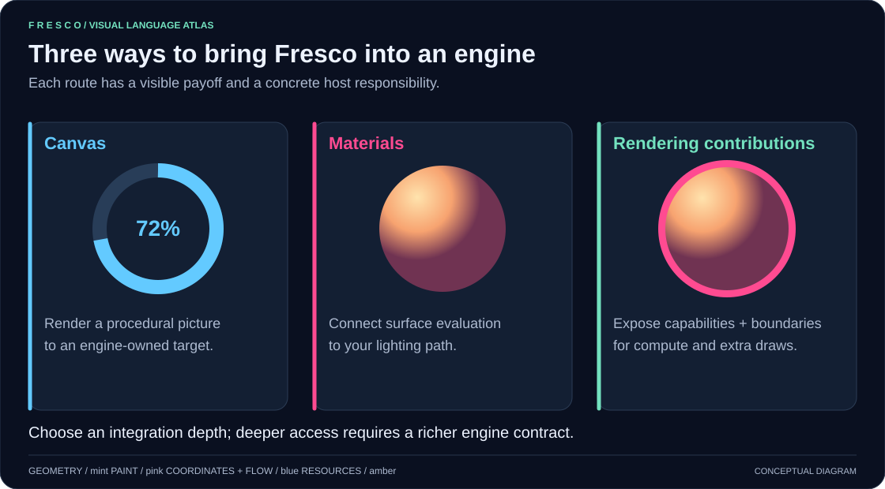
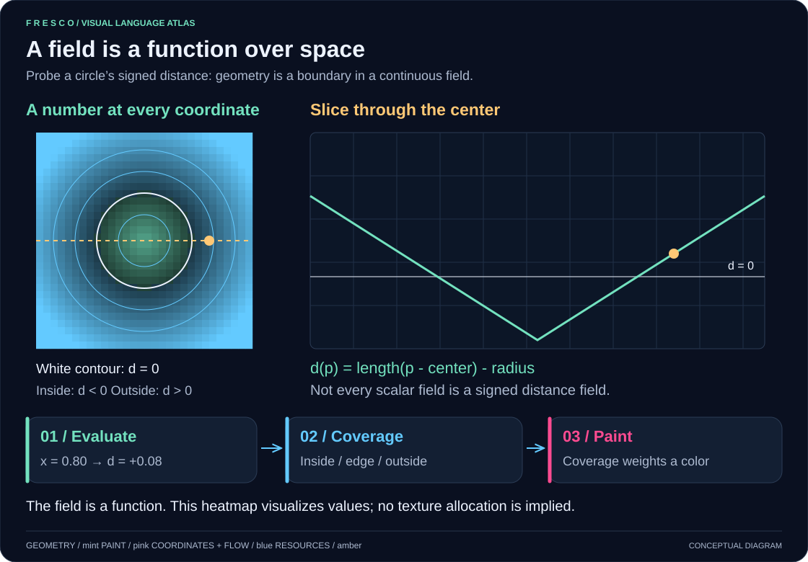
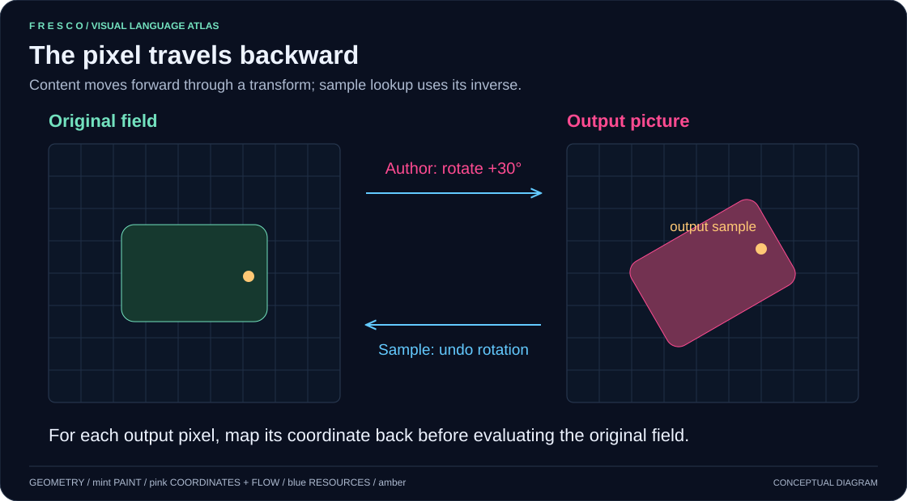
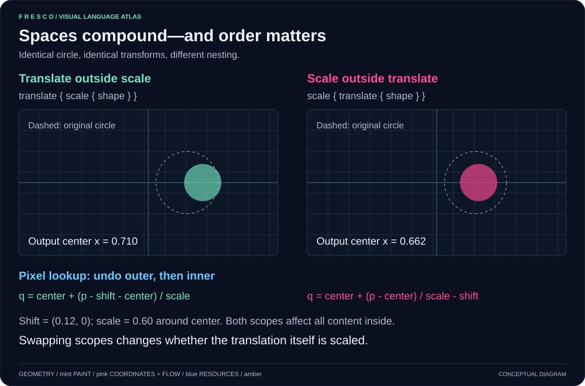
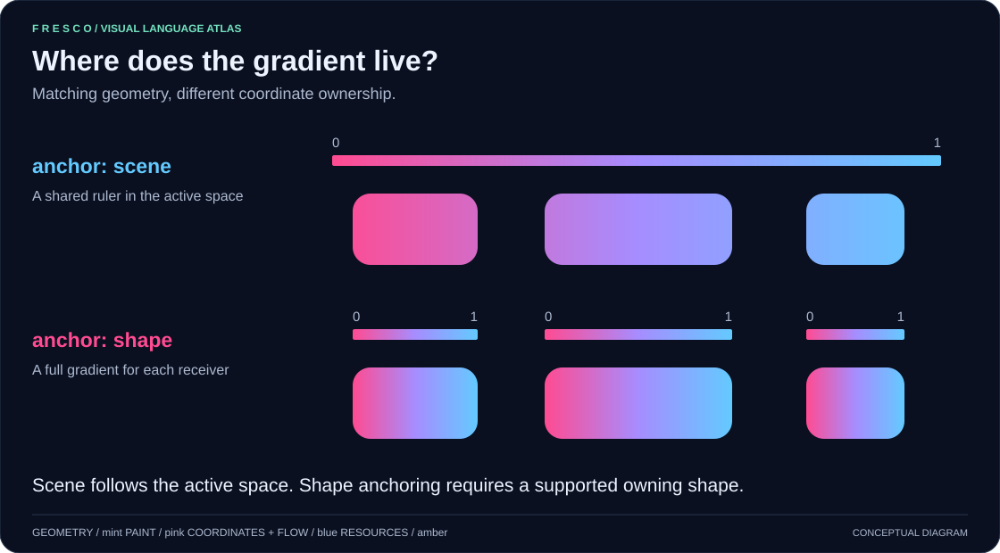
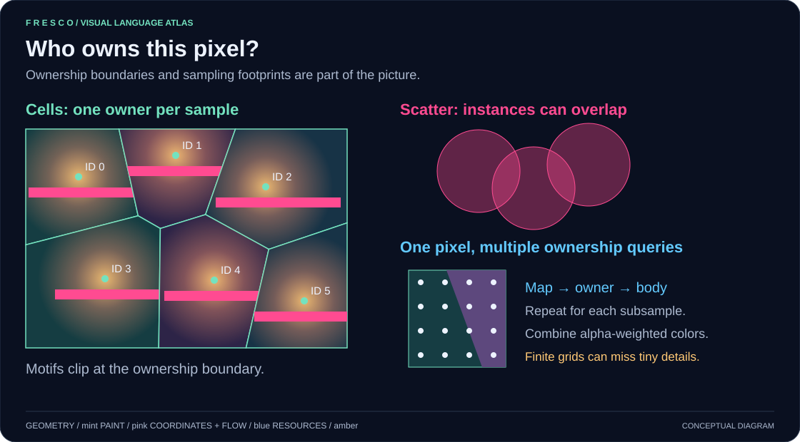
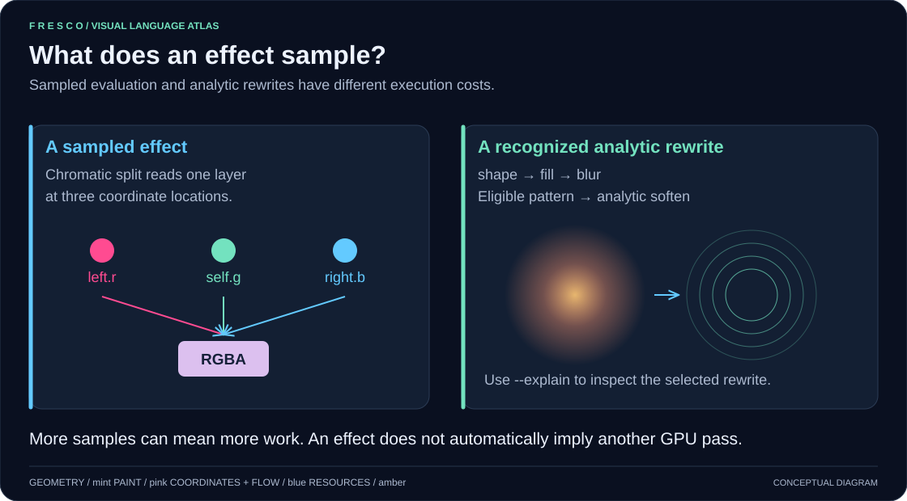
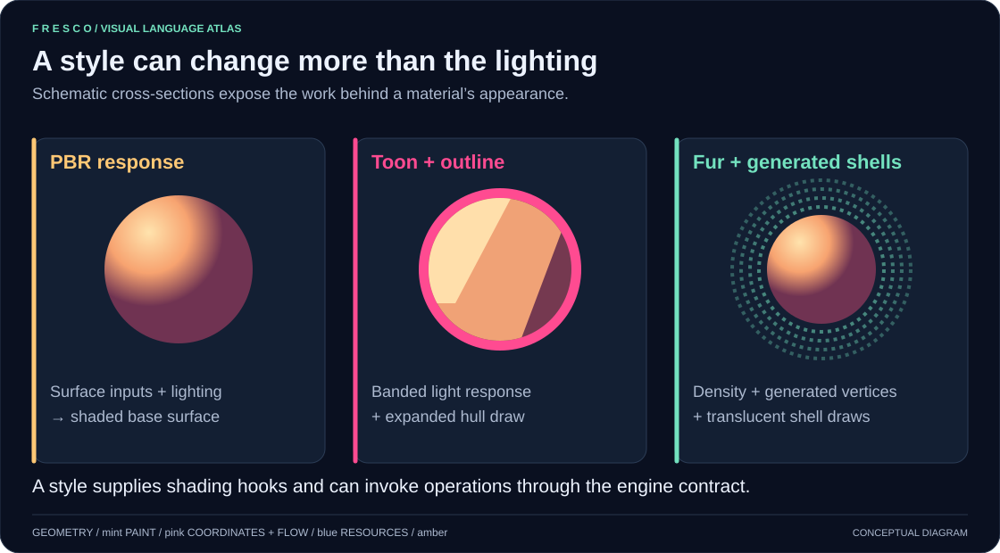
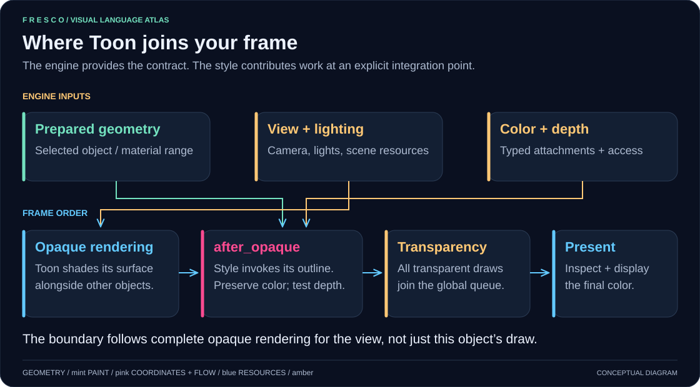
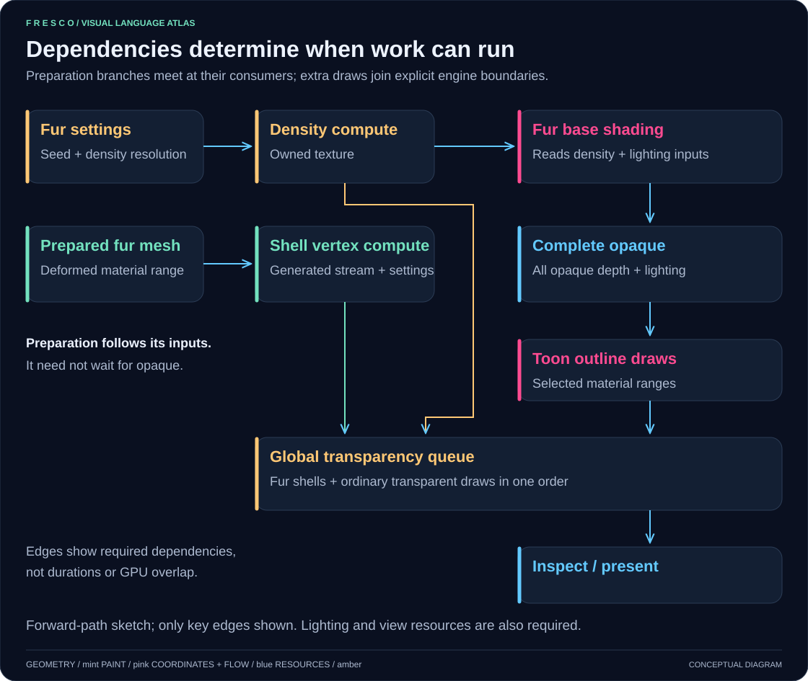

# Fresco visual guide

Start with where Fresco fits, then follow the picture down to individual samples
and GPU work. These diagrams illustrate current concepts; they are not compiler
renders, timing measurements, or promises of external engine plugins.

The SVG diagrams below display directly on GitHub and in Markdown viewers.

## Where Fresco fits


Content and engine declarations compile together. Engine authors define context,
surface contracts, capabilities, and rendering boundaries; the host implements
resource provisioning and execution. Shader code and reflected metadata are a
matched result, including stage entries, bindings, resource requirements, and
applicable execution dependencies.

The working integration is the [Rust/wgpu example engine](../integrations/example-engine/README.md),
shared by native and browser hosts. Godot, Unreal, and other engines are potential
integration targets. The diagram does not describe shipped adapters. Integrating
one requires a compatible shader/backend path, engine data bindings, and execution
support for the selected features; current WGSL output is not a drop-in promise
for another engine's material pipeline.



Choose a useful boundary first:

- **Canvas:** provide time, resolution, parameters, and textures; execute the
  supported Canvas path into a target the engine can consume.
- **Materials:** provide the surface/vertex contract, material settings, scene
  data, and renderer lighting connection.
- **Rendering contributions:** additionally provide typed capabilities, operation
  resources, explicit integration points, and supported ordering/lifetime handling.

These are integration scopes, not three universal plugin APIs. See
[host obligations](../LANGUAGE.md#host-integration-obligations) and the
[source-to-frame walkthrough](../integrations/example-engine/README.md#read-the-integration-from-source-to-frame).

## Fields: a number at every coordinate



A scalar field is a function that returns a number at a coordinate. A signed
distance field is a particular kind: for a circle, `length(p - center) - radius`
measures signed distance to its boundary. Inside is negative, the edge is zero,
and outside is positive. General scalar fields, such as noise or a varying mask,
do not necessarily measure distance.

The highlighted point in the spatial view and the point on the
V-shaped slice represent the same evaluation. The heatmap is a way to visualize
the values, not an image the shader needs to store. Painting uses coverage derived
from the field and its sampling footprint to weight a color. Near an edge,
coverage can be fractional; a hard sign test alone does not explain antialiasing.

In Fresco, `field expression` explicitly constructs a scalar field and
`layer expression` constructs a color expression. A field can participate in
evaluation without first allocating a texture. See
[fields and resampling](../LANGUAGE.md#explicit-fields-layers-and-resampling).

## One shape, several painted layers


Geometry remains reusable until an operation paints it. `stroke` produces an
outline shape; its following `fill` supplies color. The exploded view separates
the layers for inspection; it does not imply three render targets or draw calls.
The [badge example](<../examples/10) fundamentals/badge.fr>) renders the actual result.

## Spaces and inverse sampling


The track and bar share a coordinate mapping. A ring does not automatically make
a linear gradient angular; the paint must use the appropriate mapped coordinates
too. Distances after a nonlinear warp need not equal screen-pixel distances.



The highlighted output coordinate is fixed. Undoing the authored rotation locates
the coordinate to evaluate in the original field. See
[spaces and units](../LANGUAGE.md#spaces-and-units).

## How nested spaces compound



Read nested scopes from the outside in when following a **sample**. With outer
translation and inner scaling, first subtract the translation, then undo the
scale around its pivot. Read from the inside out when constructing the **picture**:
scale the geometry, then translate it.

Swapping scopes changes the result because scaling outside a translation also
scales that translation. The diagram uses a circle centered at `(0.65, 0.5)`,
radius `0.12`, translation `(0.12, 0)`, and uniform scale `0.6` around `(0.5, 0.5)`.
The resulting centers are `(0.710, 0.5)` and `(0.662, 0.5)` respectively.
At scale `1`, they coincide. Axes use normalized authored
coordinates, illustrated on a square metric rather than a particular viewport.

Both scopes apply to the content evaluated inside them, including paint. A scope
is coordinate evaluation, not an instruction to first render an intermediate
image. Nonlinear mappings also compose, but cannot generally collapse into one
affine matrix; their distance and filtering footprints require care.

## From authored code to shader evaluation


The [nested-circle sample](graphics/samples/nested-circle.fr) is a complete program
for the left-hand nesting above. Compile it with the bundled engine:

```sh
cargo run -p fresco-cli -- docs/graphics/samples/nested-circle.fr --engine-dir integrations/example-engine/engine -o target/visual-nested-circle.wgsl
```

The diagram is simplified evaluation pseudocode, not literal emitted WGSL. For
this example, generated WGSL contains operations of the following form (temporary
names and formatting may change):

```wgsl
let p_space = (p - space_offset_t0_);
// Scale lowering maps p_space around its pivot and produces p_space_1.
let d_s0_ = (length((p_space_1 - vec2<f32>(0.65f, 0.5f))) - 0.12f);
let grad_d_x = dpdx(d_s0_);
let grad_d_y = dpdy(d_s0_);
// Engine AA policy uses the footprint to compute aa_adaptive.
let fill_a_l2_ = (clamp((0.5f - (d_s0_ / aa_adaptive)), 0f, 1f) * 1f);
let col = mix(compose_over_s0_l1_, vec3<f32>(1f, 0.29411766f, 0.5686275f), vec3(fill_a_l2_));
return vec4<f32>(col, 1f);
```

This is an excerpt, not a standalone shader. The complete output also contains
the scale guards, context structs, uniform bindings, entry wrappers, and the
actual AA calculation. With an opaque background, the returned alpha is one;
other composition cases need their applicable alpha handling.

The engine's fullscreen vertex stage supplies coordinates. Its fragment entry
constructs the Canvas context and calls the generated scene evaluator. At each
sample, that evaluator computes the mapped coordinate, distance, coverage, and
color. The compiler does not issue a GPU draw for every source line or build a
circle mesh for this Canvas. Compilation, host submission, and shader evaluation
are distinct stages; the emitted artifacts describe the executable work.

See [compilation and runtime](../LANGUAGE.md#compilation-and-runtime) and
[host obligations](../LANGUAGE.md#host-integration-obligations) for the full contract.

## Gradient coordinates



Moving a shape changes its scene-anchored colors as it samples
another part of the shared ruler; its shape-anchored gradient moves with it.
`scene` refers to the active space. A shape anchor requires a supported owning
shape, and material gradients use surface UVs. See
[gradient coordinates](../LANGUAGE.md#gradient-coordinates-and-typed-texture-decoding).

## Cellular ownership and filtering



Each cellular sample has one owner. Content clips to that owner's region; scatter
instead composes instances that can overlap. Filtering reevaluates mapping,
ownership, and the body at each subsample, then combines alpha-weighted colors.
The inset is a conceptual boundary crossing, not a magnified crop of a particular
cell. Finite sampling can still miss tiny details. See
[cellular ownership](../LANGUAGE.md#cellular-ownership-and-filtering).

## Effect footprints



Sampling a layer can reevaluate its upstream work. The analytic example applies
to a recognized rewrite, not arbitrary image blur. Inspect the selected program
with `--explain`; a shader sampling operation alone does not create a host draw.
See [user effects](../LANGUAGE.md#building-and-sampling-a-user-effect).

## Styles and the engine frame



These are schematic illustrations, not visual comparisons of rendered material
quality. The executable [Toon example](<../examples/40) surface shaders/style_sample.fr>)
and the [style implementation plan](standard-shading-styles-design.md) establish
the implemented algorithms and their limitations.



In the bundled contract, `after_opaque` follows complete opaque rendering for the
view. The outline affects selected material ranges and tests depth without writing
it. It preserves existing color and precedes global transparency. Contract and
integration-point names come from the engine, not universal language keywords.



This is a simplified Forward-path dependency graph. Density is also required by
fur base shading; vertex preparation need not wait for opaque completion. The
Deferred path has a different density consumer: its resolve, rather than geometry,
waits for the resource. Lights, view data, other opaque work, and some edges are
omitted for readability. Graph position is not a timing or concurrency guarantee.
See [scheduling and lifetime](../LANGUAGE.md#scheduling-and-lifetime).

## Maintaining the graphics

Edit [graphics/generate.py](graphics/generate.py), then run:

```sh
python docs/graphics/generate.py
```

The standard-library generator writes fourteen standalone accessible SVGs with
no network dependencies. Commit the source and regenerated
outputs together. SVGs have titles, descriptions, opaque backgrounds, and text
labels in addition to color coding. Check layouts in a browser at documentation
width after edits. The Fresco sample is maintained
source, not generated by this script; recompile it when changing the shader walkthrough.

The real rendered README previews remain managed by their
[existing capture workflow](readme/README.md). Concept diagrams are separate from
those source-backed captures and from compiler regression tests.
